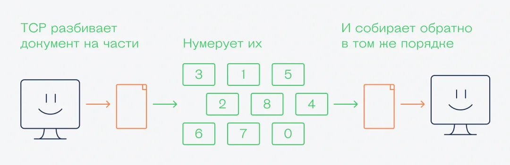

# IP
> [!info] IP
> Протокол, который отвечает за адресацию: чтобы нужные данные долетели до нужного компьютера. Основная задача — логически соединить компьютеры между собой и передавать данные между ними.

> **IP-адресс** — однозначный идентификатор устройства в некоторой сети (локальной или глобальной).

> Для этого IP выделяет **IP-адреса**, строит маршруты доставки пакетов и умеет организовать передачу данных с помощью пакетов.

> **IPv4** — 32-битный адрес, около 4 294 967 296 адресов.  
> **IPv6** — 128-битный адрес, адресов многократно больше.

* `localhost` для ОС обычно прописан в файлике `.hosts`, по умолчанию это обычно `127.0.0.1` и смежные чуть старшие значения
* `0.0.0.0` - мета адресс, он не является маршрутизируемым и по смыслу в разных механизмах подобен NULL (т.е. "автоматически подстроится", "будет слушать вообще всё", "запрет на всех" и т.п.)

## Public
* Используются для идентификации устройств в глобальной сети Интернет.
* Управляются организациями, такими как IANA (Internet Assigned Numbers Authority) и региональными интернет-регистраторами (RIR).

## Private
* Используются только внутри локальных сетей - **LAN**
* Определены в RFC 1918 и включают следующие диапазоны:

| Стартовый адрес / порт | Диапазон                        |
| ---------------------- | ------------------------------- |
| 10.0.0.0/8             | (10.0.0.0 – 10.255.255.255)     |
| 172.16.0.0/12          | (172.16.0.0 – 172.31.255.255)   |
| 192.168.0.0/16         | (191.168.0.0 – 192.168.255.255) |

Ещё примеры зарезервированных и специальных IP-адресов:

* 127.0.0.0/8 (127.0.0.0 – 127.255.255.255): Используется для loopback-интерфейса (например, 127.0.0.1 — это localhost).
* 169.254.0.0/16 (169.254.0.0 – 169.254.255.255): Используется для автоматической настройки адресов (APIPA), когда DHCP недоступен.
* 224.0.0.0/4 (224.0.0.0 – 239.255.255.255): Диапазон для multicast-адресов.
* 240.0.0.0/4 (240.0.0.0 – 255.255.255.254): Зарезервировано для будущего использования.

# MAC
> Уникальный адрес конкретного физического устройства, доступен из ближайшей локальной сети.

# Порт
> * Вот есть некоторого устройство в интернете по адресу 188.5.2.14 (цифры на угод).
> * На нём располагается некоторый сервис по поиску информации о людях. 
> * Хотим обратиться к сервису, как это сделать? 
> * Обратиться на некоторый дополнительный идентификатор, этим идентификатором является **порт**.

## Диапазоны портов
* 0–1023: Системные (well-known) порты. Используются для общеизвестных служб (например, HTTP — 80, HTTPS — 443, SSH — 22). Эти порты зарезервированы, и их использование требует прав администратора.
* 1024–49151: Зарегистрированные порты. Используются для приложений и служб, которые зарегистрированы в IANA (например, MySQL — 3306, PostgreSQL — 5432). Их можно использовать, но рекомендуется избегать конфликтов с уже зарегистрированными службами.
* 49152–65535: Динамические порты. Используются для временных соединений (например, клиентские соединения). Эти порты можно свободно использовать для своих нужд.

Некоторые порты зарезервированы для конкретных протоколов и служб:
* 20, 21: FTP (File Transfer Protocol)
* 22: SSH (Secure Shell)
* 25: SMTP (Simple Mail Transfer Protocol)
* 53: DNS (Domain Name System)
* 80: HTTP (HyperText Transfer Protocol)
* 443: HTTPS (HTTP Secure)
* 3389: RDP (Remote Desktop Protocol)

> **Listening port**. Часто говорят, что "сервис слушает порт". "Слушает" здесь как раз значит, что сервис принимает по нему данные, и отправляет (если надо обратно), но сервис не располагается по порту, располагается он на машине, но работает с другими сервисами или клиентами через конкретный порт.

# TCP
> **TCP** (**Transmission control protocol**) - протокол передачи данных, гарантирующий, что получатель точно принял целостные данные. 
> Механизм TCP предварительно устанавливает соединение с получателем и отправляет данные, если же получатель как-то отвечает, что данные утеряны, то происходит повторная отправка данных. Случаи дублирования устраняются.

**Механизм TCP handshake** подразумевает как раз такие метод синхронизации между получателем и отправителем

Но если подтверждать получение каждого пакета, то на это будет 
уходить очень много времени: при скорости сети в 100 мегабит в секунду 
реальная скорость передачи данных будет около 50 килобит в секунду. 
А всё потому, что отправитель не будет передавать новые данные, пока 
не получит подтверждение по предыдущему пакету. В итоге почти всё время 
сеть будет занята не передачей данных, а подтверждениями 
и подтверждениями подтверждений.

Чтобы не было таких задержек, в протоколе предусмотрели кумулятивное и выборочное подтверждение:

- В кумулятивном получатель подтверждает приём последнего пакета и всех предыдущих.
- В выборочном — подтверждает диапазон пакетов, которые он получил. Если
какого-то пакета нет в подтверждении, отправитель посылает его заново.
Это одна из оптимизаций работы протокола, и в TCP таких оптимизаций
много — благодаря им у нас шустрый интернет с быстрыми подтверждениями.

По умолчанию используется кумулятивное подтверждение, например, каждых 100 пакетов:

> **UDP** (**User Datagram Protocol**) - протокол передачи данных, гарантирующий, что каждая отдельно отправленная датаграмма будет передана в целостности. Датаграмма подразумевает собой пакет данных, отправка которых не требует упорядоченности или временной необходимости. Т.е. такие данные могут быть утеряны, дублироваться или приходить неупорядоченно.

Такой протокол, например, используется в играх, где необходима скорейшая передача данных, т.к. какое-либо подтверждение вызовет огромные задержки.
# CORS
> **Cross-Origin Resource Sharing** - встроенный в браузеры механизм, позволяющий регулировать то, с каких доменов допустимо обращение на текущий ресурс. 

* **По умолчанию** можно запрашивать ресурсы лишь со своего же домена, где были эти "ресурсы" и запущены. 
* Все иные домены надо всегда добавлять в политику CORS самостоятельно!
* Браузеры по умолчаню реализуют политику **Same-Origin Policy (SOP)**, т.е. буквально наследуют настройки CORS у сервера (.. ну у сайта).
* Работа CORS основана на отправке предварительного запроса **preflight request** с URI-методом `OPTIONS`, дабы узнать, разрешены ли ресурсу запросы и какие, а в ответ в положительном случаи приходит список запросов.
### Tips:
* Рекомендуется для разработки в docker swarm, k8s и т.п. использовать обратный прокси (nginx самый простой в этом плане), т.к. браузер не знает про всякие внутренние сети (и что сервисы в ней друг для друга как братья или резолвятся по имени сервиса). Браузер без обратного прокси общение фронта с бэком будет блокировать CORS'ом.
