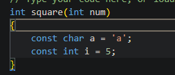

# Системы сборки

> **Система сборки кода** - специальная автоматизированая программа сборки и пересборки кода проекта (если изменили небольшую часть исходного кода), которая ищет определяет зависимости между файлами исходного кода и готовыми файлами библиотек, конфигов и т.п., а также сохраняет зависимости с прошлой сборки параллельно и выполняет поиск и выполнение программ в зависимости от текущей ОС. Система сборки кода генерирует команды для сборки исходного кода наиболее отпимизированным путём в автоматическом режиме. Система сборки по итогу генерирует файлы и по возможности файлы с дальнейшими командами для менее высокоуровневых файлов сборки. У всех систем сборки так же есть свой синтаксис..

По итогу из системы сборки должен выйти некоторый **Target** - обычно это ехе-шники, либы или иные сущности (или несколько, если надо).
### Сборка делится на 3 этапа:
- **Build configuration** - куда инсталлировать, что подключать, что дополнительно надо слинковать, какой тип сборки осуществить и т.п.
- **Building** - генерация некоторых “Make”-файлов с помощью специальных генераторов.
    - Генератором является некоторый протокол формирования такого рода файлов для конкретных платформ
- **Installation** - сборка файлов в указанного рода библиотеки и исполняемые файлы

# Механизмы создания исполняемого кода

* [Compilation](compilation.md)
* Interpretation
* JIT-compilation

# Код и память

Задачей определения *как долго будет жить объект* и/или *куда его помещать* занимается *аллокатор*. Он реализован стандартной библиотекой для каждого языка. 

## Области виртуальной памяти

Когда происходит сборка, происходит выделение памяти под такие сегменты данных такие как:

- *.bss* — Содержит статические и глобальные переменные инициализируемые 0
- *.CSTACK* — Содержит **стек** используемый программой. **Стек** работает по принципу LIFO (Last in First out, что последнее положили, то и должны первым достать), при взаимодействии со стеком обычно используется указатель на его начало. Для пк команда на выделение стека под программу выглядит как задание инструкции процессору “работать как-то с такой-то областью памяти” через регистры в своём оптимизированном алгоритме.
- *.data* — Содержит статические и глобальные инициализируемые переменные
- *.data_init* — Содержит начальные значения для данных в .data секции, если используется директива инициализации для линкера
- *HEAP* — Содержит **кучу**, используемую для размещения динамических данных. Куча работает довольно примитивно, просто при обращении к куче, задаётся размер изымаемой памяти, и память такого-то размера становится недоступной для размещения в ней объекта… таким образом образуется проблема того, что изымаемую из кучи память надо периодически освобождать.
- *.intvec* — Содержит таблицу векторов прерываний
- *.rodata* — Содержит константные данные
- *.text*  — Содержит код программы

💡 На самом деле это не обязательно так, ибо этим занимается конкретный **аллокатор**, ничего не мешает написать выделение памяти на стеке даже при написании в ЯП **new**.

## Storage duration

💡 Пример описания стандартом плюсов, несколько похожая логика много где
[Storage class specifiers - cppreference.com](https://en.cppreference.com/w/cpp/language/storage_duration)

> Непосредственно в ЯП есть только понятие storage duration - а-ля “как долго существует объект…

Есть ещё такое понятие как lifetime… **Lifetime** - это то, когда объект будет официально живой и доступен (после вызова delete или по висящей ссылке объект как бы может быть доступен, но вот стоит ли так делать).

**storage duration** - больше про то, как компилятор должен организовать его - сохранить на стеке, в специальном месте для каждого потока, или пользователь сам будет в хипе создавать-удалять.

Их 3: 

- static storage duration (статик объекты),
- automatic storage duration (обычные объекты на якобы стэке)
- dynamic storage duration (динамические объекты с new, например)
- (опционально) thread storage duration - хранит специальные локальные для потока объекты

Отсюда и связи того, когда к чему кто обращается в ОС.

## Stack allocation vs Dynamic allocation

*Почему стэк быстрее кучи?*

### Аллокация на стэке

> (грубо говоря)
- происходит запись значения в регистр
- указатель стека сдвигается на его конец

### Аллокация на куче

> (грубо говоря)

Аллокатором при компиляции на куче добавляются некоторые абстрактные прослойки - **чанки**. Чанки представляют собой некоторые участки памяти, ассоциированные с реальной памятью (обычно той же heap самой OS). Аллокатору нужно понимать: сколько памяти нужно для занятия чанка или нескольких, какие чанки заняты, нужно ли ещё добавлять какие-то чанки.. → появляется механизм или даже таблица для контроля чанками. Ну и в конце возвращается тот самый указатель на участок памяти.

<aside>
💡 Для **Windows размер стека** по умолчанию - **1 МБ**.
Для **Linux размер стека** по умолчанию - **4 МБ**, которые спокойно расширяются до 8 МБ. (Т.е. на 4 МБ стэк не переполнится, а подгрузит ещё одну страницу памяти, однако на **8 МБ** в стэке уже будет переполнение).

</aside>

## Function prologue and epilogue

[https://www.learnvulnerabilityresearch.com/stack-frame-function-prologue](https://www.learnvulnerabilityresearch.com/stack-frame-function-prologue)

> Пролог функции формируется для каждой функции при компиляции для того, чтобы хранить локальные для функции переменные и для хранения адреса возврата и адреса вызова прошлой функции. 
> В эпилоге хранится, например, смещение, на которое потом указателю на стек нужно вернуться обратно (функция выполнилось, больше её данные не нужны, они выносятся со стека, указатель на конец стека относится обратно, где был, до вызова функции), может поместиться на стек вызов предыдущей функции и т.п.

Пример Пролога функции: в `rbp` помещаются вызов прошлой функции с регистра `edi` и локальные переменные `a` (`код символа 97`) и `i` ( `целочисленная 5` ).

# Garbage collectors

> Это специальный механизм некоторых ЯП, который самостоятельно следит за временем жизни объектов.

<aside>
💡 Абстрактные грубо описанные механизмы для его работы

</aside>

- Вызов его по timeout’у
    
    Он работает не прям постоянно, он вызывается каждый раз через какое-то время (вроде даже в отдельном потоке), вызывается, спрашивается <кто есть или кто больше не нужен>, удаляются ненужные объекты и он засыпает
    
- Счётчик того, сколько не использовался объект
    
    Ему нужно понимать как-то, используется ли вообще объект или нет, если не используется, то встаёт вопрос о его удалении
    
- Необходимость компилятору “доказать”, что больше объект не будет использоваться
	- Ему нужно как-то доказать, что объект можно удалять, т.к. он больше не будет нужен, для этого внутри garbage collector’а реализована структура процесса исполнения. По которой и происходит доказательство.  
		* В плюсах этот граф исполнения слегка сложный, из-за чего в нём невозможно алгоритмически решить задачу доказательства → поэтому в плюсах нет garbage collector’а. (Он как-то на бумаге был с 11 по 17-20 стандарты, но был удалён)
		* В питоне этот граф сделан так, что в строку можно прям помещать название переменной, а информация под неё соответствующе подцепиться. 
		* В Rust это дерево вообще.. что даже в межпоточке компилятор может выдавать ошибки аж на этапе сборки. 