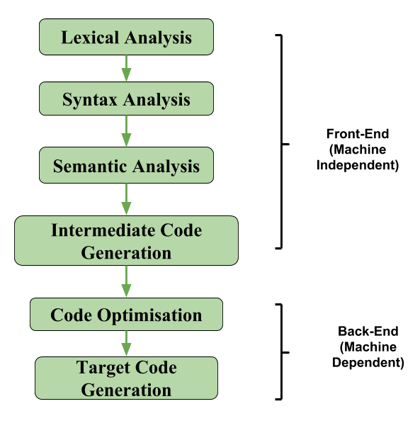

> Вот пункты ниже прям по порядку
# 1. Preprocessor

> **Препроцессорная сборка -** макро процессор, который преобразует код в его конечный вид, т.е. удаление комментов, подключение директив, замена define, подключение хэдеров и т.п. Получается препроцессорный код *.ii(для С++) с флагом -Е, оберегая от повторной компиляции.*
# 2. Compilation
> *Компиляция - преобразование препроцессорного кода в ассемблерный код с флагом (*.s)-S, ассемблерный код преобразуется в бинарные файлы (х86 процессором), а затем он сохраняется в объектные файлы (*.о).

💡 Также данный объектный код может быть сохранён в качестве статической библиотеки, чтобы не компилировать его снова каждый раз. (Библиотеки см. ниже здесь же)

Компиляция делится на несколько этапов…



## Lexical analysis
> Проводится анализ написанного кода, где каждая строчка делится на специальные группы - **лексемы**, в итоге из этого должен получится поток **токенов**.

```jsx
//данная строчка
net_worth_future = (assets — liabilities);

//преобразуется в поток токенов по типу:
ИМЯ "net_worth_future" 
ПРИСВАИВАНИЕ 
ОТКРЫВАЮЩАЯ_СКОБКА 
ИМЯ "assets" 
МИНУС 
ИМЯ "liabilities" 
ЗАКРЫВАЮЩАЯ_СКОБКА 
ТОЧКА_С_ЗАПЯТОЙ
 
```

### Лексема
💡 **Лексема** (лингвистика) - слово как абстрактная единица морфологического анализа. В одну лексему объединяются разные парадигматические формы одного слова
* Лексемы далее преобразуются в токены с соответствующими идентификаторами…
### Токен
> Когда лексема представляет собой чисто набор символов “слова”/элемента, токен уже является структурой из слова и какого-то набора его характеристик, применимые уже к соответствующему языку.

💡 Лексема является экземпляром токена, но не равносильна токену сама по себе.
### Генератор лексических анализаторов
> Для распознавания строки в данном на вход исходном тексте  используются специальные генераторы, одними из них являются: Lex, Flex, re2c и т.п.
## Syntax analysis
> Синтаксический анализатор (или **парсер**) используется для преобразования полученных токенов в более удобную структуру для анализа - **абстрактное синтаксическое дерево (AST).**
* На этом этапе так же проверяются синтаксические ошибки.
* Парсинг может происходить по разным алгоритмам, бывают такие алгоритмы как: LL, LR, LR(1), LALR и прочие…
* Также существуют разного рода вывод или **восстановление после ошибок,** где весь анализ может прекратиться, например, на одной ошибке, а может проанализировать как можно больше ошибок в “тексте” (уже дереве).
# Semantics analysis
> Предназначен для анализа взаимосвязей элементов абстрактного синтаксического дерева.
## Intermediate code generator
> На этом этапе source код преобразовывается в промежуточный код, для некоторых ЯП такие промежуточные коды свои (например, байткод в контексте JIT для java).

Почему это надо?
- Оптимизации над промежуточным кодом проводить куда лучше с точки зрения влияния на конечный перфоманс программы
- Чтобы для разных языков не было необходимости иметь один единственный какой-то “нативный” компилятор. Также есть такой фактор, как платформозависимость, т.е. с таким этапом код проще портировать на разные машины.
## Optimization
> На этом этапе проводятся оптимизации кода для обеспечения лучшего перфоманса.
* Разного рода типы сборок “Release” и “Debug”, например, имеют разные указания уровней оптимизаций для компилятора. 
* Например, если попытаться отдебажить RelWithDebInfo сборку, то можно увидеть, как какой-нибудь принт может вывестись раньше его вызова → это значит, что компилятор уже много чего там мог убрать по пути и, в действительности, код выглядит уже далеко не так, как его написали изначально.
## Code generation
> На этом этапе уже происходит генерация машинного кода, зависящего от типа имеющегося ассемблера. Дальше этот код вместе с имеющимися таблицами для линковки улетает на Linking stage.

💡 Формат файла для объектного кода COFF для Windows и ELF для Linux

# 3. Linkage
> **Линковка**(**Компановка**) - совмещение всех объектных файлов в 1 исполняемый. 
* Взаимосвязи между объектными файлами обеспечиваются **таблицами символов**. 
* Это структуры данных в объектных файлах, которые **хранят имена классов, методов, объектов, функций и переменных с их соответствующими идентификаторами** (тип, область видимости), адресы ссылок на данные и процедуры в других объектных файлах.
### Tips:
- [Libraries](libraries.md)
# Lodaing 
> Далее вызывается **загрузчик** для **запуска** **программы** в память, где возможно подключение динамических библиотек.
