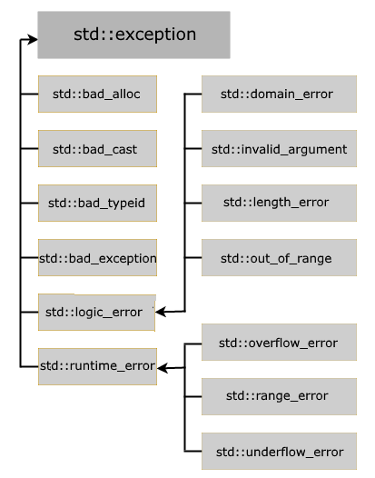

# Exceptions
> В процессе работы программы могут возникать различные ошибки. Например, при передаче файла по сети оборвется сетевое подключение или будут введены некорректные и недопустимые данные, которые вызовут падение программы. Такие ошибки еще называются исключениями. **Исключение** представляет временный объект любого типа, который используется для сигнализации об ошибке. Цель объекта-исключения состоит в том, чтобы передать информацию из точки, в которой произошла ошибка, в код, который должен ее обработать.

Существуют разные типы исключений:

- **runtime_error**: общий тип исключений, которые возникают во время выполнения
- **range_error**: исключение, которое возникает, когда полученный результат превосходит допустимый диапазон
- **overflow_error**: исключение, которое возникает, если полученный результат превышает допустимый диапазон
- **underflow_error**: исключение, которое
возникает, если полученный в вычислениях результат имеет недопустимое
отрицательное значение (выход за нижнюю допустимую границу значений)
- **logic_error**: исключение, которое возникает при наличии логических ошибок к коде программы
- **domain_error**: исключение, которое возникает, если для некоторого значения, передаваемого в функцию, не определен результат
- **invalid_argument**: исключение, которое возникает при передаче в функцию некорректного аргумента
- **length_error**: исключение, которое возникает при попытке создать объект большего размера, чем допустим для данного типа
- **out_of_range**: исключение, которое возникает при попытке доступа к элементам вне допустимого диапазона



### Tips
- Стараться придерживаться стандартных исключений
- Если система довольно глубокая, то правильнее всего возвращать в ней коды ошибок, а исключения кидать уже на самом верхнем уровне
- Не надо плодить куча try-catch, лучше их сделать как можно выше, дабы обхватить всё
- Не кидать свои объекты в исключения (плюсы позволяют сделать просто `throw 7;`, например)

# Try-catch-throw
В `try{}`: пробуемый блок кода, который может выбросить исключение.
В `catch()`: объявляется или “описывается” исключение, которое мы должны поймать.
В `catch{}`: что выполняется при получении исключения и как его обрабатывать

throw: выкидывает исключение из текущего места программы, которого должен поймать catch… какое сообщение throw прилетает, такое в catch и ловится, прилетает RunTimeException, объявляем RunTimeException* e, прилетает string - объявляем const string* msg.

```cpp
try
{
    инструкции, которые могут вызвать исключение
}
catch(объявление_исключения)
{
    обработка исключения
}

throw <исключение>
```

```cpp
/* Пример */
double divide(int a, int b)
{
    if (b)
        return a / b;
    throw "Division by zero!";
}
  
int main()
{
    int x{500};
    int y{};
     
    try
    {
        double z {divide(x, y)};
        std::cout << z << std::endl;
    }
    catch (const char* error_message)
    {
        std::cout << error_message << std::endl;
    }
    std::cout << "The End..." << std::endl;
}
```

```cpp
int divide(int a, int b) {
    if (b == 0) {
        throw std::runtime_error("Division by zero!");
    }
    return a / b;
}

int main() {
    int num1, num2;

    std::cout << "Enter two numbers for division: ";
    std::cin >> num1 >> num2;

    try {
        int result = divide(num1, num2);
        std::cout << "The result is: " << result << std::endl;
    } catch (const std::exception& e) {
        std::cerr << "Error: " << e.what() << std::endl;
    }

    return 0;
}
```

- **Все** **деструкторы** помечены ключевым словом **noexcept** согласно стандарту - т.е. они не могут выбрасывать исключения. Однако возможны случаи, когда деструктор где-то в иерархии указан noexcept=false, а это свойство потом ещё и отнаследуется
- Исключения триггерят `terminate()` программы и вызов деструкторов (если у объекта есть close() вместо деструктора или что-то такое.. то деструктор не вызовется.. см. RAII). Все объекты со стека (automatic duration) будут уничтожены корректно
- Деление на 0 в С++ не ловится стандартными исключениями =)
- В С нет механизма исключений, но для разных ОС есть свои приколы, для винды это SEH https://learn.microsoft.com/ru-ru/cpp/cpp/structured-exception-handling-c-cpp?view=msvc-170. `try-except` блок...

# Exception по существу
> Является “налепляемой” структурой на метод, эта структура содержит информацию об исключении и, возможно, даже набор исключений.

Например, вот так выглядит exception на Win32.

```c
typedef struct _EXCEPTION_RECORD {
  DWORD                    ExceptionCode;
  DWORD                    ExceptionFlags;
  struct _EXCEPTION_RECORD *ExceptionRecord;
  PVOID                    ExceptionAddress;
  DWORD                    NumberParameters;
  ULONG_PTR                ExceptionInformation[EXCEPTION_MAXIMUM_PARAMETERS];
} EXCEPTION_RECORD;
```

Т.е. даже на метод, где просто прибавляется 1, по факту лепится подобного рода структура уже в бинарнике. 

**Как триггерится исключение?** - Может быть такая ситуация, когда код просто пытается обратиться по указателю на адрес, к которому доступ самой ОС запрещён, тогда ОС выдаст запрет и вернёт подобного рода EXCEPTION_RECORD. Который уже ЯП несколько иначе расшифрован. Также во время триггера исключения происходит развёртка стека вызовов → это нужно для того, чтобы найти обработчика исключений.

# noexcept
> Ключевое слово, которое указывает, что данный метод не кидает исключения.

Если **метод noexcept**, но внутри него выбрасывается исключение, то произойдёт `std::abort`

```cpp
template<typename T>
inline constexpr decltype(auto) Summ(T a, std::type_identity<T> b) noexcept {
	return a + b;
}
```

Указывает компилятору, что данная функция не кидает исключения.

Зачем? - Затрагивает ту структуру выше, компилятор просто как-то её сокращает или убирает, т.е. производит некоторого рода оптимизацию.. хотя да, должно убирать, но это зависит от компилятора. Для MSVC есть, например, отдельный атрибут NOTHROW, который определён с помощью __declspec(notrhow). Для clang и gcc это может быть вообще __attribute__((***nothrow***)) или что-то иное.

# Раскрутка стэка
> Stackframe - кадровый стэк, в котором обычно хранятся вызовы функций, локальные для неё переменные, пролог и эпилог функции. Стэк состоит из stackframe'ов.
> Когда выбрасывается исключения, то стэк вплоть до вызова своей функции начинает раскручивать стэк, т.е. удаляются всякие последующие/вложенные вызовы функций, локальные переменные и т.п. 
```cpp
void DoSth() {
	const int a = 5;		// попадает в стэкфрейм для функции DoSth
	const int b = 10;               // попадает в стэкфрейм для функции DoSth

	throw std::logic_error();
}


int main() try {
	DoSth();                        // в стэкфрейме лежит функция DoSth(), её локальные переменные, эпилог и пролог, и вот этот стэкфрейм как раз очищается
} catch(...) { //... }
```

# multiple exceptions
> По документации С++ выбрасывание исключения во время раскрутки стэка при обработке другого исключения приводит к `std::terminate()`

```cpp
// Пример
struct Dummy {
	~Dummy noexcept(false) {
		throw Exception1;
	}
};

int main() try {
	Dummy dmy;
	throw Exception2;       // первое выбрасывание исключения
}                               // пока раскручивается стэк, выбрасывается исключение деструктора Dummy
                                // <- поэтому тут уже std::terminate вызовется
catch(...) {
	// ...
}

int main() try {		// Пример, где всё будет в порядке, т.к. каждое исключение выбрасывается отдельно
	throw Exception1;	
	throw Exception2;
} catch(...) { //... }
```
# Exception safety levels
- Конструкторы по умолчанию имеют базовую гаранитю исключений, т.е. если будет выброшено исключение, то  неконтролируемой кодом утечки памяти не произойдёт, поэтому в нём спокойно можно кидать исключения
  
## Nothrow
> Гарантируется, что исключение из данного метода выброшено быть не может

## Strong guarantee
> В случае исключения состояние объекта будет сброшено на то, которое было до вызова метода, откуда было брошено исключение

## Basic guarantee

> В случае исключения объект останется в корректном, но неопределённом состоянии. Т.е. все инварианты останутся верными и не произойдёт утечка ресурсов, но никакое конкретное состояние не гарантируется.
> Исключения в конструкторе как раз должны подразумевать подобную логику.

## No guarantee
> Исключение может вылететь, не *exception-safe*, ошибка в проектировании программы
