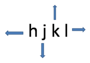

> "Coding is just an excuse to use Vim" (c) Any true gigachad
* **Vi** - встроенное средство линух для редактирования текста
* **Vim** - его модифицированная версия от Билла Джойа, написанная на vimrc, автор погиб, проект того...
* **Nvim** - опенсурсная реализация, написанная на lua

**Для перемещения по тексту**
(если Vim куда-то интегрирован или клава не без стрелок, то может не работать)


* Интерактивная “документация” ([https://imgur.com/YLInLlY](https://imgur.com/YLInLlY))
* [https://imgur.com/YLInLlY](https://imgur.com/YLInLlY)
# Vim docs
[https://vim.rtorr.com/](https://vim.rtorr.com/)
# Vim ru-docs
[https://1cloud.ru/help/linux/vim_help](https://1cloud.ru/help/linux/vim_help)
# LSP Server
> Если захочется использовать nvim/vim в качестве IDE, то стоит знать, что это такое...
* Это Language Support Protocol сервер, который разворачивается "латентно" локально на том же ПК, что и IDE и общается с IDE с помощью JSON-RPC, получая информацию о проекте, текущей строке, вводе и т.п.
* LSP сервер же, в свою очередь, отдаёт, условно ответы: где искать переменную, какой функцию можно вызвать на основе написанного (text auto completion) и т.п.
* LSP решает проблему соответствия кучи языков в куче фреймворкой сокращая её от "комплексности" `M-редакторов * N-языков` до `M + N`
* https://www.youtube.com/watch?v=LaS32vctfOY
# Regex
* [Regex syntax](regex.md)
## Magic mode
> Немного упрощённый синтаксис, который ещё и не требует экранизации символов
* Иногда удобнее
* Иногда хватает ненужное и проще строгим паттерном написать
## Examples
> Based on `:s/old/new` + *regex*
### Find + replace + capture
* `per line view mode` + `s/pub const \(\w\+\) = .*/test { _ = \1; }`
* `per line view mode` + `s/pub const \(.*\) = .*/test { _ = \1; }
```sh
pub const hello = @import("world.zig");
pub const tutty = @import("tutty.zig");

	// to this vvv 
	
test { _ = hello; }
test { _ = tutty; }
```
### Find magic + replace
> `\v` - начало magic mode
* `per line view mode` + `s/\v"zx.+\ze"/\$server/g`
```bash
vav = "aasl;dkfjasd"
var = "alsdfjasdkf:43"

vav = "$server"
var = "$server"
```