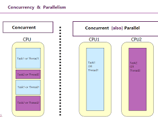

# Start
> **4 всадника “контекста” исполнения:**
## synchronous programming
> **Физический процесс**, при котором операции выполняются друг за другом. Следующая операция не может выполниться до окончания текущей.
## asynchronous programming
> **Подход**, при котором выполнение следующей операции может быть осуществлено до окончания текущей.
* Это может быть всё в основном потоке с помощью некоторые хитрого механизма событий или event loop
* Может быть реализовано с помощью вспомогательного потока
> [Asynchronous programming](resources/async.md)
## parallel programming
> **Физический процесс**, при котором выполнение операций происходит параллельно с разделением контекстов.
> Т.е. обычно тут несколько "акторов". Например несколько потоков, несколько пк, несколько процессов и т.п.
## concurrency
> Ранее "озвученный" в пунтке про асинхрощину случай с использованием дополнительного 1 или нескольких потоков и называется "конкурентным" подходом.
> Т.е. мы можем перенести контекст текущего потока в другой и ожидать выполнения задачи параллельно.

1. Не является исключением, противопоставлением или строго частным случаем **параллельности**.
2. concurrency может быть как на 1 ядре/потоке, так и быть параллельным на нескольких потоках.
3. Вполне стандартным механизмом в таком случае является “переключение контекстов”.

💡 Вытащить Арифметический блок отсюда*
[The central processing unit (CPU): Its components and functionality](https://www.redhat.com/sysadmin/cpu-components-functionality)

# Threads
> Поток - минимальная единица исполнения задачи. 
> Вот какая-нибудь функция должна где-то выполнятся, очевидно, что она выполняется в каком-то потоке, иначе быть не может.

* Физический поток -> 1 ядро процессора создаёт 1 поток.
* Логический поток -> 1 ядро процессора разбивает физический поток на 2 логических.
* Hyperthreading - технология компании Intel, позволяющая на 1 ядре выполнять 2 потока вместо 1. (На самом деле можно сделать и больше, но сейчас переключение контекстов для 3 и более потоков приносит меньше перфоманса, чем при работе с разделением на 2 потока. )

* Иногда любят делить потоки на user-context, os-context, kernel-context, code-context и т.п. ЯП используют потоки ОС явно или обёртками. 
# Контекст…

## Переключение контекста
> * Это процесс, при котором операционная система (подобное есть и на уровне процессера, но там немного иначе) временно приостанавливает выполнение одного потока и передаёт управление другому. 
> * Это происходит, чтобы эффективно использовать ресурсы процессора, когда несколько потоков или процессов должны выполняться параллельно или когда один поток должен ждать, например, завершения ввода/вывода или освобождения блокировки.

## Контекст
> **Контекст** в данном случае — это все данные, которые необходимы для (продолжения) работы потока (или процесса). 

### Контекст включает в себя:
- **Состояние процессора**: значения всех регистров процессора, включая:
    - **Счётчик команд (Program Counter)** — указывает на следующую инструкцию, которую нужно выполнить.
    - **Регистры общего назначения** — содержат промежуточные данные, используемые при вычислениях.
    - **Флаги состояния** — хранят информацию о текущем состоянии процессора (например, флаг переноса для арифметических операций).
- **Стек**: указатель на текущий стек потока, который содержит информацию о вызовах функций, локальных переменных, данных для возврата после вызова функции и т.д.
- **Память**: информация о том, какие страницы памяти закреплены за потоком.

# Scheduling (планировщик)
> Некоторого рода служба, принимающая решение, кому отдать задачу или кто простаивает и т.п.
> Выбор текущего потока из нескольких активных потоков, пытающихся получить доступ к процессору называется **планированием**. 
> Процедура планирования обычно связана с весьма затратной **процедурой диспетчеризации** — переключением процессора на новый поток, поэтому планировщик должен заботиться об эффективном использовании процессора.

Поток может находиться в одном из трёх состояний:
- Выполняемый (Executing) — поток, который выполняется в текущий момент на процессоре.
- Готовый (Runnable) — поток ждет получения кванта времени и готов выполнять назначенные ему инструкции. Планировщик выбирает следующий поток для выполнения только из готовых потоков.
- Ожидающий (Waiting) — работа потока заблокирована в ожидании блокирующей операции.

В реальных задачах важность работы разных потоков может сильно различаться. Для контроля этого процесса был придуман **приоритет** работы. У каждого потока есть такое числовое значение приоритета. Если есть несколько спящих потоков, которые нужно запустить, то ОС сначала запустит поток с более высоким приоритетом. ОС управляет потоками так, как посчитает нужным. Потоки с низким приоритетом не будут простаивать, просто они будут получать меньше времени, чем другие, но выполняться все равно будут. Потоки с одинаковыми приоритетами запускаются в порядке очереди. Приоритет потока может меняться в процессе выполнения. Например, после завершения операции ввода-вывода могут увеличивать приоритет потока, чтобы дать ему возможность быстрее начать выполнение и, может быть, вновь инициировать операцию ввода-вывода. Таким способом система поощряет интерактивные потоки и поддерживает занятость устройств ввода-вывода.

Потоки могут быть созданы не только в **режиме ядра**, но и в **режиме пользователя**, в зависимости от того, какой планировщик потоков используется:
- Центральный планировщик ОС режима ядра, который распределяет время между любым потоком в системе.
- Планировщик библиотеки потоков. У библиотеки потоков режима пользователя может быть свой планировщик, который распределяет время между потоками различных процессов режима пользователя.
- Планировщик потоков процесса. К примеру свой Thread Manager есть у каждого процесса Mac OS X, написанного с использованием библиотеки Carbon.

## Как происходит переключение контекста?
Когда операционная система решает приостановить выполнение текущего потока (например, для того, чтобы дать возможность другому потоку поработать), она выполняет следующие шаги:
1. **Сохранение контекста** текущего потока: операционная система сохраняет все текущие данные этого потока (значения регистров, указатель стека и т.д.) в определённой области памяти (обычно в блоке данных, связанном с этим потоком). Это нужно для того, чтобы потом поток мог продолжить выполнение с того места, где он был приостановлен.
2. **Загрузка контекста нового потока**: затем операционная система восстанавливает контекст другого потока, который должен начать выполнение. Она загружает данные (регистры, указатель стека и т.д.), которые были сохранены, когда этот поток был приостановлен в последний раз.
3. **Передача управления** новому потоку: после восстановления контекста операционная система передаёт управление новому потоку, и он продолжает выполнение с того места, где был приостановлен.

## Когда происходит переключение контекста?
Переключение контекста может происходить в нескольких случаях:
1. **Принудительное вытеснение (preemption)**: операционная система использует планировщик потоков, чтобы периодически переключаться между ними, даже если поток ещё не завершил свою работу. Это делается для того, чтобы распределять процессорное время между всеми потоками.
2. **Ожидание ресурсов**: если поток ожидает освобождения ресурса (например, заблокированного мьютекса или завершения операции ввода/вывода), операционная система может приостановить его и переключиться на другой поток, чтобы не тратить время на ожидание.
3. **Блокировка на ожидание**: поток может быть заблокирован в ожидании какого-либо события (например, `std::condition_variable::wait()`), и тогда его контекст сохраняется до тех пор, пока событие не произойдёт.

# Thread pool
> **Thread pool** (пул потоков) — это модель многопоточности, в которой заранее создаётся фиксированное количество потоков, и эти потоки повторно используются для выполнения задач, вместо того чтобы создавать новый поток для каждой задачи. Основная идея заключается в том, чтобы избежать затрат на создание и уничтожение потоков, что может быть дорого в плане ресурсов.
> Основная его задача - распределение и выполнение задачи на какой-то конкретный поток (или несколько, если так попросили извне). Планировщик потоков не исполняет задачи, а только следит за состоянием потоков.
> По умолчанию он реализован только в Windows, в Linux он написан сторонними либами вроде бы...

**Как работает?**
1. **Инициализация**: при старте приложения создаётся фиксированное (или динамическое) количество потоков. Эти потоки готовы принимать задачи на выполнение, но они находятся в состоянии ожидания (idle) до тех пор, пока не появятся задачи.
2. **Добавление задач**: задачи, которые необходимо выполнить, добавляются в **очередь задач** (task queue). Это могут быть любые задачи, требующие параллельного выполнения, например, обработка запросов, выполнение вычислений и т.д.
3. **Назначение задач**: как только задача поступает в очередь, один из потоков в пуле берёт эту задачу и начинает её выполнение. После завершения задачи поток не уничтожается, а возвращается в состояние ожидания и готов принимать новые задачи.
4. **Повторное использование потоков**: после выполнения задачи поток возвращается в пул и может быть использован для выполнения другой задачи. Это значительно сокращает накладные расходы по сравнению с созданием нового потока каждый раз.
5. **Пул потоков может быть фиксированным или динамическим**:
    - **Фиксированный пул потоков**: количество потоков в пуле задаётся на этапе создания и не меняется. Например, пул может содержать 4 потока, и они будут обрабатывать задачи, пока все задачи не будут выполнены.
    - **Динамический пул потоков**: количество потоков может увеличиваться или уменьшаться в зависимости от нагрузки. Например, если появляется больше задач, чем может обработать текущий пул, создаются новые потоки, а после снижения нагрузки лишние потоки могут быть уничтожены.

# IRQL
> **Interrupt Request Level** или **уровень запроса** - это что-то из разряда прав потока.

**Как это и зачем это?** - Это означает что планирование cpu не позволит какому-нибудь потоку с уровнем *IRQL 20* сместить (прервать, выполнить себя и вернуть управление обратно) поток с уровнем *IRQL 29*. Чем выше такой номер, тем такой поток должен работать  по времени (желательно, это ничем не контролируется).

**Scheduler** работает примерно лишь до 2 уровня (DPC/DISPATCH).

 *link:* https://ru.wikipedia.org/wiki/IRQL