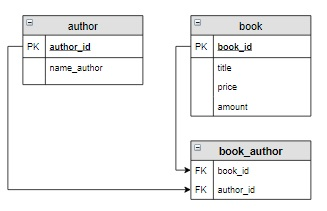
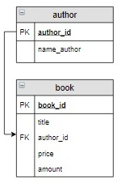
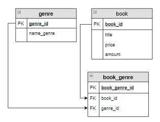

# Base concepts

- _**отношение**_  – это структура данных целиком, набор записей (в обычном понимании – таблица) , в  примере –это `**Сотрудник**`;
- _**кортеж**_ – это каждая строка , содержащая данные (более распространенный термин – запись ), например, <00_1, Борин С.А, 234-01-23, программист_>, все кортежи в отношении должны быть различны;
- _**мощность**_ – число кортежей в таблице (проще говоря, число записей), в данном случае 3, мощность отношения может быть любой (от 0 до бесконечности), порядок следования кортежей - неважен;
- _**атрибут**_ – это столбец в таблице (более распространенный термин – поле ), в примере – `**Табельный номер, Фамилия И.О., Телефон, Должность**`) 
- _**размерность**_ – это число атрибутов в таблице, в данном случае – 4;
- размерность отношения должна быть больше 0, порядок следования атрибутов существенен;
-  _**домен атрибута**_ – это допустимые значения (неповторяющиеся), которые можно занести в поле , например для атрибута `**Должность**` домен – {инженер, программист}.
## Primary Key
> SQL таблица должна иметь как минимум 1 `уникальный идентификатор-ключ`, ключ не может быть пустым (`NULL`) и должен хранить только уникальные значения.
### Foreign Key
> Foreign Key - внешний ключ, который является ссылкой/связью на primary key в некоторой исходной таблицы. Он нужен для связывания изменения данных в обоих таблицах.

В таблице **book** *первичным ключом* является **book_id**.
В таблице **author** *первичным ключом* является **author_id**.
В таблице **book_author** *внешними ключами* являются **book_id** и **author_id**, они связаны с соответствующими *первичными ключами* соответствующих таблиц.

# Syntax
> В разных системах БД синтаксис слегка отличается, но не особо глобально, скорее где-то по-своему реализован "синтаксический сахар". Также некоторые запросы в некоторых видах SQL БД могут вовсе не поддерживаться. 
> В примерах ниже будет рассматриваться классический вариант MySQL.
> Завершение одного запроса можно (и нужно) выделить "завершающим оператором" `;`
## Types
* https://www.w3schools.com/sql/sql_datatypes.asp
## Relations
### 1-to-many
> Связь "один ко многим".

**Один автор** имеет **множество книг**. 
**Каждая из этих книг** может иметь **только одного автора**.
**Один автор ко множеству книг**.

### 1-to-1
### many-to-many
> Связь "многие ко многим".

**Пример** таблицы **один ко многим**. **Книга** может содержать только **1 автора** и **1 жанр**.
**book** является **конкретной отдельной абстракцией** со своими полями.


**Жанр** может относится **к нескольким книгам**. **Книги** могут иметь **несколько жанров**. 
У, например, `book1` может быть `genre1` и `genre2`, т.е. 2 записи в `book_genre`
У `genre1` могут быть записи `book1`, `book2`, т.е. 2 записи в `book_genre`. 
`book_genre` выступает строго **описателем связи**.
**Многие ко многим**. 

## Commands
### Приоритет операций
1. FROM
2. WHERE
3. GROUP BY
4. HAVING
5. SELECT
6. ORDER BY

### Агрегирование
> Агрегацией, в общем случае , является процесс объединения элементов в одну систему. 
> В контексте SQL **агрегирование** выполняют такие функции как `MIN`, `MAX`, `AVG`, `SUM` и т.п. Результат выполнения этих функций - **агрегированные значения**.

### CREATE  TABLE
> Создаёт таблицу с указанным именем и атрибутами
```sql
CREATE TABLE name (
	name_id        INT PRIMARY KEY AUTO_INCREMENT,
	fst_column     VARCHAR(50),
	sec_column     DECIMAL(3, 1)
);
```
### INSERT (INTO) ... VALUES ... 
> Вставляет атрибут и значение записи.
```sql
INSERT INTO name (fst_column, sec_column)
VALUES ("New value", 999.9),
       ("Another new value", 100.1);
```
### SELECT ... FROM ...
> Запрос на выбор атрибутов/полей из таблицы или иного источника.
```sql
SELECT * FROM name
SELECT customer_id, customer_name FROM Customers
```
* `DISTINCT` позволяет вывести только уникальные значения
```sql
SELECT DISTINCT author
FROM book;
```
### WHERE
> Некоторого рода фильтр на исполняемый запрос, такой запрос работает на `не агрегированные` значения.
```sql
SELECT * FROM name
WHERE sec_column < 10.0 OR 
      fst_columnt NOT IN ("Impossible value", "Not a value")
      
SELECT author, title, price FROM book
WHERE amount < 10
```
### GROUP BY
> Запрос на группировку данных. (Коллапс данных в набор неодинаковых значений)
```sql
SELECT author, COUNT(amount)
FROM book
GROUP BY author;
```
### COUNT(...) AS ...
> Запрос, меняющий название поля
```sql
SELECT title AS Название, author AS Автор
FROM book;

SELECT title, amount, amount * 1.65 AS pack
FROM book;
```

### HAVING
> Запрос подобный `WHERE`, но для уже агрегированных значений.
```sql
SELECT author, 
       ROUND(SUM(price * amount), 2) AS Стоимость
FROM book
WHERE title NOT IN ("Идиот", "Белая гвардия")
GROUP BY author
HAVING SUM(price * amount) > 5000
ORDER BY Стоимость DESC;
```
### ORDER BY
>  Запрос, сортирующий данные в таблице по некоторому порядку. 
>  **ASC** - по возрастанию (оно же по умолчанию), **DESC** - по убыванию
```sql
SELECT author, title FROM book
WHERE amount BETWEEN 2 AND 14
ORDER BY author DESC, title ASC;
```
### LIKE
> Pattern matching для каждого элемента, упрощённая версия Regular expression концепта.

Ключевыми моментами являются:
* `_` (означает любой одиночный символ)
* `%` (означает любую последовательность символов, пустую тоже)
* все остальные символы в аргументе паттерна являются распознаваемыми, т.е. вставленный пробел в запрос рода `LIKE "% %"` будет распознаваться как обязательный символ между любыми последовательностями символов или же просто 1 пробел.
```sql
SELECT title, author FROM book
WHERE 
    title LIKE "_% _%"
AND 
    author LIKE "%С.%"
ORDER BY title;
```
### JOIN


### IF-condition
> IF (`condition`, `if_true_block`, `if_false_block`)
```sql
SELECT 
    author, 
    title, 
    ROUND(IF (author = "Булгаков М.А.",
              price * 1.1, 
              IF (author = "Есенин С.А.", 
                  price * 1.05, price)), 
          2) AS new_price
FROM book;

```
### LOGICAL OPERATORS
> https://www.w3schools.com/mysql/mysql_operators.asp
```sql
SELECT title, author FROM book
WHERE 
    (price BETWEEN 540.5 AND 800)
AND 
    (amount IN (2, 3, 5 ,7));

```
### MATH
| **Функция**   | **Описание**                                                                                                     | **Пример**                              |
| ------------- | ---------------------------------------------------------------------------------------------------------------- | --------------------------------------- |
| `CEILING(x)`  | возвращает наименьшее целое число, большее или равное **x**  <br>(округляет до целого числа в большую сторону)   | `CEILING(4.2)=5   CEILING(-5.8)=-5`     |
| `ROUND(x, k)` | округляет значение **x** до **k** знаков после запятой,  <br>если **k** не указано – **x** округляется до целого | `ROUND(4.361)=4   ROUND(5.86592,1)=5.9` |
| `FLOOR(x)`    | возвращает наибольшее целое число, меньшее или равное **x**  <br>(округляет до  целого числа в меньшую сторону)  | `FLOOR(4.2)=4   FLOOR(-5.8)=-6`         |
| `POWER(x, y)` | возведение **x** в степень **y**                                                                                 | `POWER(3,4)=81.0`                       |
| `SQRT(x)`     | квадратный корень из **x**                                                                                       | `SQRT(4)=2.0   SQRT(2)=1.41...`         |
| `DEGREES(x)`  | конвертирует значение **x** из радиан в градусы                                                                  | `DEGREES(3) = 171.8...`                 |
| `RADIANS(x)`  | конвертирует значение **x** из градусов в радианы                                                                | `RADIANS(180)=3.14...`                  |
| `ABS(x)`      | модуль числа **x**                                                                                               | `ABS(-1) = 1   ABS(1) = 1`              |
| `PI()`        | pi = 3.1415926...                                                                                                |                                         |
# Resources
Тренировался и вытаскивал примеры отсюда: https://stepik.org/course/63054/syllabus