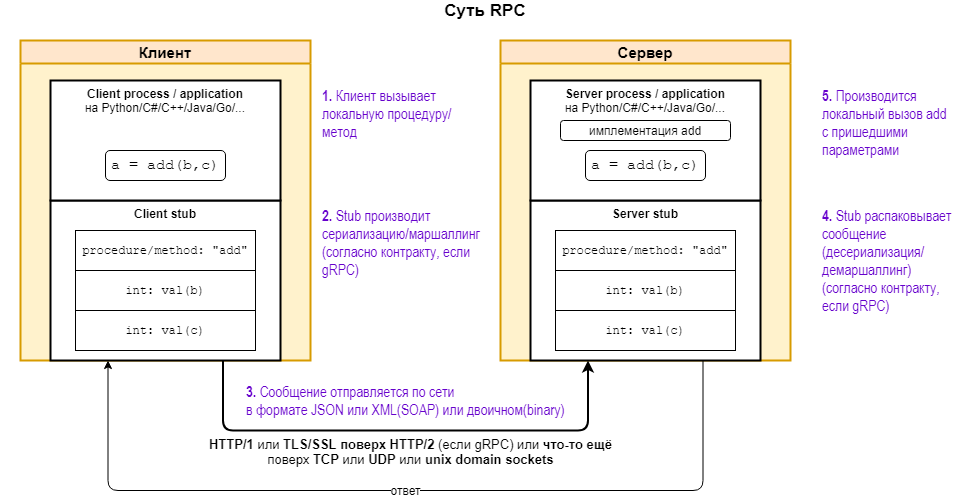

 > Remote Procedure Call (RPC) - Механизм для удалённого вызова функций.
 > Клиент выполняет функцию (или процедуру) на сервере, и сервер отправляет результат обратно клиенту.
 > Обычно саму функцию упоковывают в JSON или XML и передают на сервер, сервер распаковывает и выполняет переданную ему процедуру. 

💡 gRPC (Google), JSON-RPC и прочие - лишь отдельные протоколы (иногда фреймворки) для реализации механизма RPC.

💡 [https://habr.com/ru/articles/787164/](https://habr.com/ru/articles/787164/)
