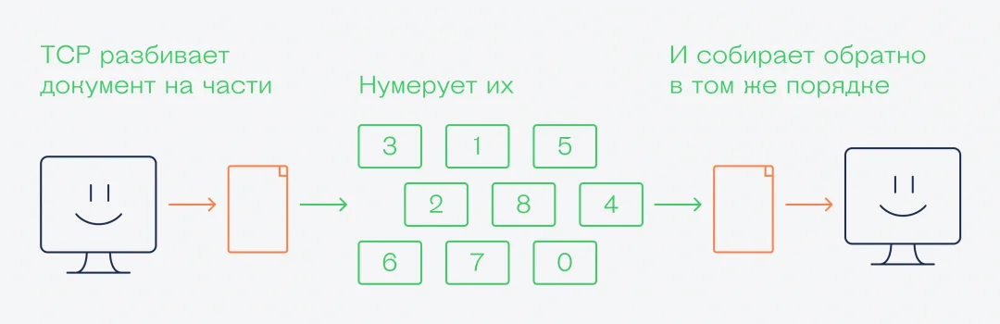

> **TCP** (**Transmission control protocol**) - протокол передачи данных, гарантирующий, что получатель точно принял целостные данные. 
> Механизм TCP предварительно устанавливает соединение с получателем и отправляет данные, если же получатель как-то отвечает, что данные утеряны, то происходит повторная отправка данных. Случаи дублирования устраняются.

**Механизм TCP handshake** подразумевает как раз такие метод синхронизации между получателем и отправителем

Но если подтверждать получение каждого пакета, то на это будет 
уходить очень много времени: при скорости сети в 100 мегабит в секунду 
реальная скорость передачи данных будет около 50 килобит в секунду. 
А всё потому, что отправитель не будет передавать новые данные, пока 
не получит подтверждение по предыдущему пакету. В итоге почти всё время 
сеть будет занята не передачей данных, а подтверждениями 
и подтверждениями подтверждений.

Чтобы не было таких задержек, в протоколе предусмотрели кумулятивное и выборочное подтверждение:

- В кумулятивном получатель подтверждает приём последнего пакета и всех предыдущих.
- В выборочном — подтверждает диапазон пакетов, которые он получил. Если
какого-то пакета нет в подтверждении, отправитель посылает его заново.
Это одна из оптимизаций работы протокола, и в TCP таких оптимизаций
много — благодаря им у нас шустрый интернет с быстрыми подтверждениями.

По умолчанию используется кумулятивное подтверждение, например, каждых 100 пакетов:

> **UDP** (**User Datagram Protocol**) - протокол передачи данных, гарантирующий, что каждая отдельно отправленная датаграмма будет передана в целостности. Датаграмма подразумевает собой пакет данных, отправка которых не требует упорядоченности или временной необходимости. Т.е. такие данные могут быть утеряны, дублироваться или приходить неупорядоченно.

Такой протокол, например, используется в играх, где необходима скорейшая передача данных, т.к. какое-либо подтверждение вызовет огромные задержки.