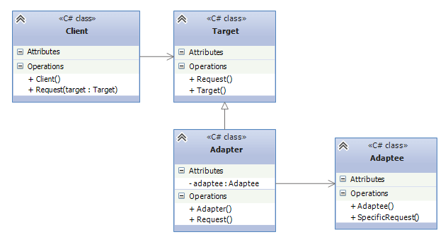

> Данный паттерн предназначен для ситуации, когда нужно заставить 2 абсолютно разные сущности работать вместе с помощью некоторого класса-прослойки/адаптера.




## Субъекты

Часто адаптер применяют для преобразование интерфейса легаси кода в более удобный интерфейс, возьмём для примера такой случай:
Для примера возьму некоторый класс, который будет пользоваться 2-мя не особо совместимыми классами:

```cpp
class Driver {
public:
	void travel(ITransport transport) {
		transport.drive();
	};
};

```

### Target

- Модуль, который используется, но который не очень удобен для некоторого случая

```cpp
class ITransport {
public:
	virtual ~ITransport() noexcept = default;
public:
	virtual void drive() = 0;
};

class Auto : public ITransport  {
public:
	void drive() override {
		std::cout << "Car is driving" << std::endl;
	};
};

```

### **Adaptee**

- Модуль, который мы бы хотели использовать

```cpp
class IAnimal {
public:
	virtual ~IAnimal() noexcept = default;
public:
	virtual void move() = 0;
};

class Camel : public IAnimal { // верблюд
public:
	void move() override {
		std::cout << "Camel is moving " << std::endl;
	};
};

```

### **Adapter Class**

- Класс, который будет является тем самым соединяющим звеном

```cpp
 class CamelToTransportAdapter : ITransport
 {
	 Camel camel_;
public:
	CamelToTransportAdapter(Camel camel) {
		camel_ = camel;
	};

	void drive() {
		camel_.move();
	};
 };

```

### **Client**

```cpp
int main()
{
	auto driver = std::make_unique<Driver>();
	auto car = std::make_unique<Auto>(); // lol

	driver->travel(car); // driver travels on transport, which is auto

	auto camel = std::unique_ptr<Camel>();
	std::unique_ptr<ITransport> camel_transport = std::make_unique<CamelToTransportAdapter>(camel);
	driver->travel(camel_transport); // передаём внутрь указатель транспорта, имея в объекте преобразование drive в move, в travel используется метод drive у ITransport типа, но содержимое изначального объекта (Адаптера) использует метод move животного

	return 0;
}

```

## Нюансы

- Адаптеры идейно похожи на костыли, поэтому их использование может очень сильно усложнить код и испортить его философию

## Use-cases

- Когда необходимо использовать имеющийся класс, но его интерфейс не соответствует потребностям
- Когда надо использовать уже существующий класс совместно с другими классами, интерфейсы которых не совместимы

### Стандартные случаи использования

- Для легаси кода
- Для совместимости библиотек или со сторонней библиотекой
- Для создания общего интерфейса взаимодействия классов
- Для создания адаптера-тестировщика