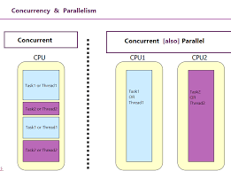

# Start
> **4 всадника “контекста” исполнения:**
## synchronous programming
> **Физический процесс**, при котором операции выполняются друг за другом. Следующая операция не может выполниться до окончания текущей.
## asynchronous programming
> **Подход**, при котором выполнение следующей операции может быть осуществлено до окончания текущей.
* Это может быть всё в основном потоке с помощью некоторые хитрого механизма событий или event loop
* Может быть реализовано с помощью вспомогательного потока
> [Asynchronous programming](async.md)
## parallel programming
> **Физический процесс**, при котором выполнение операций происходит параллельно с разделением контекстов.
> Т.е. обычно тут несколько "акторов". Например несколько потоков, несколько пк, несколько процессов и т.п.
## concurrency
> Ранее "озвученный" в пунтке про асинхрощину случай с использованием дополнительного 1 или нескольких потоков и называется "конкурентным" подходом.
> Т.е. мы можем перенести контекст текущего потока в другой и ожидать выполнения задачи параллельно.

1. Не является исключением, противопоставлением или строго частным случаем **параллельности**.
2. concurrency может быть как на 1 ядре/потоке, так и быть параллельным на нескольких потоках.
3. Вполне стандартным механизмом в таком случае является “переключение контекстов”.

# Threads
> Поток - минимальная единица исполнения задачи. 
> Вот какая-нибудь функция должна где-то выполнятся, очевидно, что она выполняется в каком-то потоке, иначе быть не может.

* Физический поток -> 1 ядро процессора создаёт 1 поток.
* Логический поток -> 1 ядро процессора разбивает физический поток на 2 логических.
* Hyperthreading - технология компании Intel, позволяющая на 1 ядре выполнять 2 потока вместо 1. (На самом деле можно сделать и больше, но сейчас переключение контекстов для 3 и более потоков приносит меньше перфоманса, чем при работе с разделением на 2 потока. )

* Иногда любят делить потоки на user-context, os-context, kernel-context, code-context и т.п. ЯП используют потоки ОС явно или обёртками. 
## thread subjects
* стэк - всякие переменные
* регистры процессора - хранение вычислений
* ID потока
* указатель на инструкцию (функция) - мы же обычно пишем (`std::thread::spawn(|| println!("hello world"))`)
* состояние потока - готов, ожидает и т.п.
* много чего ещё...
# Context

> **Контекст** в данном случае — это все данные, которые необходимы для (продолжения) работы потока (или процесса). 
## Хранит внутри...
- **Состояние процессора**: значения всех регистров процессора
    - **Счётчик команд (Program Counter)** — указывает на следующую инструкцию, которую нужно выполнить.
    - **Регистры общего назначения** — содержат промежуточные данные, используемые при вычислениях.
    - **Флаги состояния** — хранят информацию о текущем состоянии процессора (например, флаг переноса для арифметических операций).
- **Стек**: указатель на текущий стек потока, который содержит информацию о вызовах функций, локальных переменных, данных для возврата после вызова функции и т.д.
- **Память**: информация о том, какие страницы памяти закреплены за потоком.
# mutex
> **Mutual exclusion** (взаимное исключение) - это **механизм синхронизации**, где под его термионолигией подразумевается, что если 1 поток получает доступ к ресурсу, то он исключает эту возможность для других потоков. 
* Т.е. поток единолично "владеет" ресурсом
* Данные, оберегаемые мьютексом, называются **критической секцией**
* Также есть **контекст процессора и контекст ОС**, в контексте ОС всё легковеснее и не так тяжело, но всё ещё занимает прилично времени
* Вроде бы блокировка мьютекса занимает порядка **100нс**
## Windows
* Вызывается `WaitForSingleObject(HADNLE ..., ... ms)` -> https://learn.microsoft.com/en-us/windows/win32/api/synchapi/nf-synchapi-waitforsingleobject
	* `Wait` у нас в любом контексте изречения обычно блокирует текущий поток...
* **Прилетает какой-то первый попавшийся**, например, поток 
	* (в сигнатуре функции выше есть входной параметр HANDLE, т.е. получить хэндл можно над чем угодно, включая поток)
* Далее в дело вступает некоторый **Scheduler** (планировщик), он смотрит за тем, что в критической секции сейчас только 1 поток
* если к секции попробуeт получить доступ другой поток - то этот поток планировщик **усыпит** (~ поток уснёт)
* Под усыплением понимается то, что **контекст потока** сохраняется и в некоторой внутренней очереди Sheduler'а ставится в какое-нибудь место 
	* (по идеи вот в каком порядке потоки ломятся, в таком же порядке они там push_back'аются в очередь)
* Соответственно, **разлочить мьютекс может только поток**, который вот это время находился в критической секции...
* Использует SRWLock под капотом
## Linux
* Глобально также, но вот пока не изучал =)
# atomic
> Некоторый **примитив синхронизации** между потоками. Суть в том, что у нас есть некоторая **специальная инструкция на уровне процессора**, которая гарантирует **атомарность операции** над нашим значением. 

* атомарность - любой другой поток может только лишь знать про результат до и после выполнения операция, но ничего промужточно (можно сослаться на оную идеологию в транзакциях)
* т.к. это специальная атомарная инструкция на уровне процессора, то её реализация всегда и везде **зависит от архитектуры процессора!**
* по факту внутри ещё можно задать порядок операций из разряда - т.н. **memory order** (сначала все записи + потом чтение, relax order и т.п.), но как будто бы это только в С++
# spinlock
> **Механизм опроса** в цикле типа `while()`, где объектом опроса может являться состояние потока.
> Т.е. в `while(true) { могу ли я обратиться к ресурсу? }` до тех пор, пока не получится
* Вполне ОК, если опрашиваем короткое время
* Не ОК, если вполне возможно длительное ожидание -> занимает процессорное время таким надоедливым опросом
# семафор
> Некоторый **примитив синхронизации**, который ведёт некоторый счётчик того, сколько потоков имеют доступ к ресурсу.
* есть 2 вида:
	* бинарный (счётчик потоков равен либо 0, либо 1)
		* мьютекс разлочить может только поток, что его захватил, а семафор уже кто угодно...
	* обычный (счётчик потоков задаётся)
* внутри это вполне может быть атомик + спинлок
# other primitives
* conditional variables
* rw-lock
* monitors
* event flags
* message passing
* *link ->* https://www.youtube.com/watch?v=50ZBUNyLsBs
# lock-free
> Структуры и/или алгоритмы без явной блокировки контекста -> https://habr.com/ru/articles/197520/
# корутины
> Более легковесные "потоки", порядка нескольких Кб. 
> Работает со стэком потока или даже стэкфреймами... (не уверен по поводу последнего)
* *link ->* https://habr.com/ru/articles/850970/
## statefull
> Механизм базируется на сохранении контекста в стэк. 
* Есть некоторая функция, мы её помечаем как корутину
* Функция - это что? Это, в некотором смысле, стэкфрейм
* В стэкфрейме есть локальные переменные и прочее, т.е. это, грубо говоря, контекст нашего легковесного "потока"
* Этот контекст мы вполне законно храним на стэке, а также параллельно храним указатель на этот стэкфрейм
* Ну у нас теперь есть контекст, есть указание на инструкции, всё 
* В такого рода контексте можно хранить много всякой информации, включая иерархию вызовов других функций, хотя это занимает прилично места на стэке, но не критично
* НЕяркий **пример** -> **Go**, неяркий - потому что там всё сильно переиначено, и это буквально перфоманс stateless с функционалом statefull
## stateless
> По факту хранит очень малую часть контекста тоже на стэке
* Есть свой планировщик
* Работает по принципу машины состояний
* На стэке храниться очень мало информации о корутинах, и она требуется планировщику, поэтому переключение контекста и потребление ресурсов очень минимально
* **Примером** будут являться очень **многие ЯП**, включая Rust и Kotlin
# Scheduling (планировщик)
> Некоторого рода служба, принимающая решение, кому отдать задачу или кто простаивает и т.п. Т.е. предоставляет возможности планирования и диспетчеризации потоков.

* Поток в такой службе имеет **состояния**:
	* **Executing** - сейчас работает
	* **Runnable** - поток готов в выполнению
	* **Waiting** - ожидает, пока разлочат нужный ему ресурс
* Планировщиков **может быть несколько** (общий, для каждого процесса и т.п.)
* Поток может быть создан **в режиме ядра и в режиме юзера**
* У планировщика, очевидно, **есть очередь** какая-то для потоков
* У потоков в планировщике всё же **есть приоритеты**
* *link ->* https://habr.com/ru/companies/otus/articles/549814/

## Переключение контекста
> **Переключение контекста** - процесс при котором OC временно приостанавливает выполнение одного потока и передаёт управление другому.  Нужно, чтобы эффективно использовать ресурсы процессора
 
 * Это когда мы хотим переключиться на другой поток, мы должны как-то сохранить состояние текущего потока...
### Как?
* **Сохранение контекста** - нужно же как-то понимать, где поток остановил свою работу, т.е. мы сохраняем так состояние
* **Загрузка контекста нового потока** - помогаем потоку "вспоминать", где он остановился
	* загружаются данные (регистры, указатель стека и т.д.), которые были сохранены, когда этот поток был приостановлен в последний раз.
* **Передача управления** - новому потоку: после восстановления контекста операционная система передаёт управление новому потоку, и он продолжает выполнение с того места, где был приостановлен.
### Когда контекста?
* **Принудительное вытеснение (preemption)** - увы, ОС может сама решать, как лучше и когда выполнять разного рода задачи.
* **Ожидание ресурсов** - штатная ситуация, что если поток ждёт освобождения ресурсов, то его усыпляет ОС (ну т.е. планировщик)
* **Блокировка на ожидание** - штатная ситуация... опять же, `wait` в любом контексте и ЯП блокирует текущий поток
## Thread pool
> **Thread pool** (пул потоков) — это модель многопоточности, в которой заранее создаётся фиксированное количество потоков, и эти потоки повторно используются для выполнения задач, вместо того чтобы создавать новый поток для каждой задачи. 
* Если планировщик потоков только менеджит потоки и следит за их состоянием, то трэд пул **непосредственно решает как использовать потоки** для выполнения задач
* Т.к. создание потока немножко тяжкая вещь (около 1 Мб вроде), трэд пул может поток с завершённой задачей **переиспользовать поток** для новой задачи, не создавая новый поток
* **Основная его задача** - **распределение и выполнение задачи** на какой-то конкретный поток (или несколько, если так попросили извне). 
* По умолчанию он реализован только в Windows, в Linux он написан сторонними либами вроде бы...

### Как работает?
1. **Инициализация**: при старте приложения создаётся фиксированное (или динамическое) количество потоков. 
   Эти потоки готовы принимать задачи на выполнение, но они находятся в состоянии ожидания (idle) до тех пор, пока не появятся задачи.
2. **Добавление задач**: задачи, которые необходимо выполнить, добавляются в **очередь задач** (task queue). 
   Это могут быть любые задачи, требующие параллельного выполнения, например, обработка запросов, выполнение вычислений и т.д.
3. **Назначение задач**: как только задача поступает в очередь, один из потоков в пуле берёт эту задачу и начинает её выполнение. 
   После завершения задачи поток не уничтожается, а возвращается в состояние ожидания и готов принимать новые задачи.
4. **Повторное использование потоков**: после выполнения задачи поток возвращается в пул и может быть использован для выполнения другой задачи.
    Это значительно сокращает накладные расходы по сравнению с созданием нового потока каждый раз.
5. **Пул потоков может быть фиксированным или динамическим**:
    - **Фиксированный пул потоков**: количество потоков в пуле задаётся на этапе создания и не меняется. Например, пул может содержать 4 потока, и они будут обрабатывать задачи, пока все задачи не будут выполнены.
    - **Динамический пул потоков**: количество потоков может увеличиваться или уменьшаться в зависимости от нагрузки. Например, если появляется больше задач, чем может обработать текущий пул, создаются новые потоки, а после снижения нагрузки лишние потоки могут быть уничтожены.
## IRQL
> **Interrupt Request Level** или **уровень запроса** - это что-то из разряда прав потока.

**Как это и зачем это?** - Это означает что планирование cpu не позволит какому-нибудь потоку с уровнем *IRQL 20* сместить (прервать, выполнить себя и вернуть управление обратно) поток с уровнем *IRQL 29*. Чем выше такой номер, тем такой поток должен работать  по времени (желательно, это ничем не контролируется).

**Scheduler** работает примерно лишь до 2 уровня (DPC/DISPATCH).

 *link:* https://ru.wikipedia.org/wiki/IRQL

