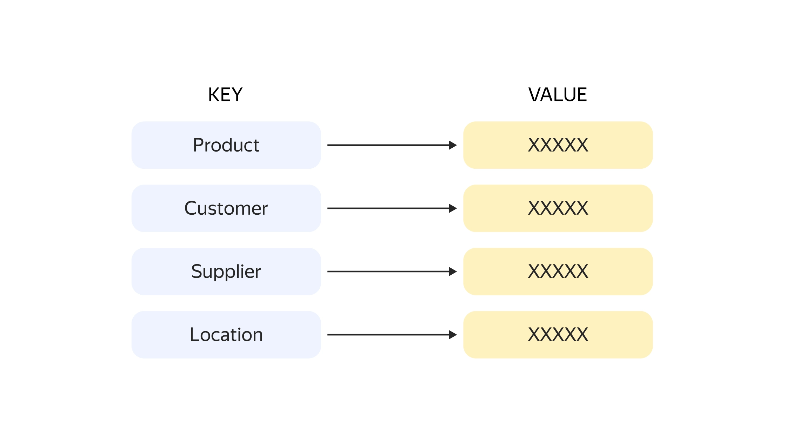
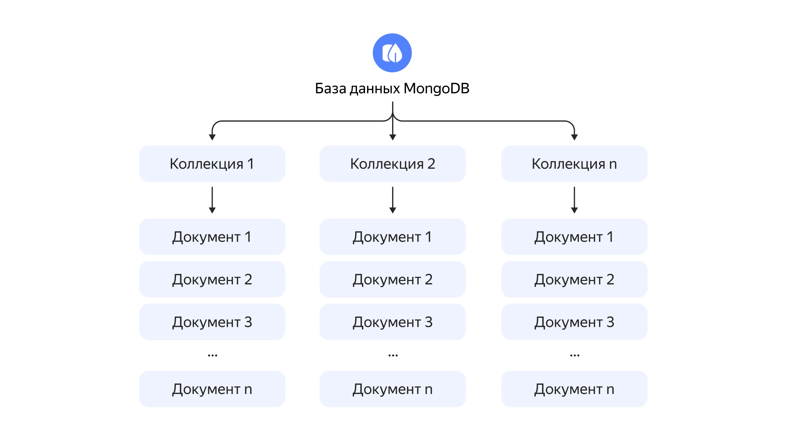
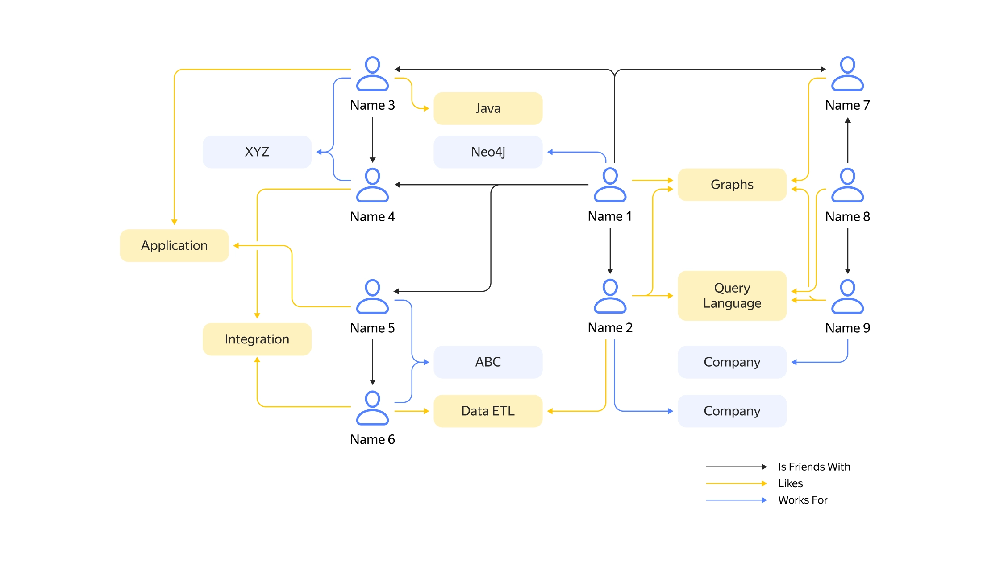

> **Нереляционные базы данных**, данные в таких случаях не связаны жёстко по типу тех же таблиц, а распределены. 
> Нет ACID.

**Примеры:**
* MongoDB -> document-orientated store
* ClickHouse, Cassandra -> column family store
* Redis -> key-value
* Neo4j -> graph-based
# Types
> Когда нет строгой структуры, то очевидно, что кто-то хоть какую-то структуру должен породить...
link -> https://yandex.cloud/ru/blog/posts/2022/10/nosql?utm_referrer=https%3A%2F%2Fwww.google.com%2F
## key-value store
> В этой БД записи хранятся в парах «ключ — значение», где ключ выступает уникальным идентификатором. Ключи и значения фиксируются в виде простой или составной информации. Эти хранилища максимально быстро реагируют на запросы информации и прекрасно масштабируются.
Key-value СУБД часто используется для систем, в которых скорость является приоритетом, а данные не слишком сложные. Например, для хранения кеша данных, онлайн-списков, обработки истечения срока действия, разделения сеансов, построения рейтинга и прочих задач.

## column family store
> Эти БД имеют свои столбцы и строки, но информация записывается в колонки. Колонки между собой не связаны, поэтому удаление или добавление новых свойств не затрагивает остальную систему. Отсутствие заранее заданной схемы позволяет хранить в этих NoSQL-базах записи без чёткой структуры.
> В традиционной СУБД при выполнении запроса сканируется вся таблица, а информация из всей строки извлекается целиком. В колоночных БД выгружаются только необходимые значения, поскольку поиск ведётся по отдельным столбцам. Такой подход колоночных NoSQL баз к хранению информации позволяет быстро получать данные из больших таблиц для анализа. А возможность сильного сжатия данных экономит много места на диске.

## Document-orientated store
> В БД этого типа данные записываются в документы и хранятся в формате, подобном JSON. Таким хранилищам свойственны иерархичность (документы складываются в коллекции, а коллекции группируются логически) и гибкость (значения, свойства и их структура может меняться в процессе разработки).
Document-oriented-модель хороша в проектах, где нужно обрабатывать большой объём данных без четкой структуры, а также для работы со множеством уникальных документов, которые со временем требуют изменений. Например, для каталогов товаров, соцсетей, платформ с блогами и видео, геоаналитики и в других сферах.

## Graph store
> Элементы базы данных хранятся в узлах (вершинах), между узлами существуют ребра, которые определяют отношения элементов друг к другу. У ребра есть начальный и конечный узел, направление и тип (связи действия, права владения, «родитель — ребёнок» и пр.). Главная особенность графовых БД — хранение не только сущностей данных, но и взаимосвязей, тогда как в реляционных БД соединения между элементами требует дополнительных вычислений.
Благодаря такой модели данных graph store NoSQL используются для выполнения задач, ориентированных на связи: для алгоритмов рекомендаций контента, социальных сетей, обнаружения случаев сетевого мошенничества.

**Зачем?** 
* При запросе в **реляционную** БД информация запрашивается **из нескольких таблиц одновременно**, это не быстрая операция
* Если БД сильно **скейлится**, то **реляционной** БД довольно сложно поддерживать **огромное кол-во связей и таблиц**
* **Вертикальное масштабирование** для **реляционных** БД - довольно дорого и тяжело
* **Реляционные** БД **плохо поддаются шардированию** данных
# Для чего полезны
* Легко скаллировать
* Гибкость структур данных
	* когда не нужна строгость или полнота структуры
	* когда структура меняется размером или полями
	* когда структура огромная
