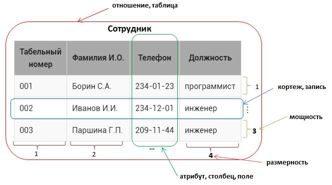

# Base concepts

- _**отношение**_  – это структура данных целиком, набор записей (в обычном понимании – таблица) , в  примере –это `**Сотрудник**`;
- _**кортеж**_ – это каждая строка , содержащая данные (более распространенный термин – запись ), например, <00_1, Борин С.А, 234-01-23, программист_>, все кортежи в отношении должны быть различны;
- _**мощность**_ – число кортежей в таблице (проще говоря, число записей), в данном случае 3, мощность отношения может быть любой (от 0 до бесконечности), порядок следования кортежей - неважен;
- _**атрибут**_ – это столбец в таблице (более распространенный термин – поле ), в примере – `**Табельный номер, Фамилия И.О., Телефон, Должность**`) 
- _**размерность**_ – это число атрибутов в таблице, в данном случае – 4;
- размерность отношения должна быть больше 0, порядок следования атрибутов существенен;
-  _**домен атрибута**_ – это допустимые значения (неповторяющиеся), которые можно занести в поле , например для атрибута `**Должность**` домен – {инженер, программист}.
## Primary key
> SQL таблица должна иметь как минимум 1 `уникальный идентификатор-ключ`, ключ не может быть пустым (`NULL`) и должен хранить только уникальные значения.
# Syntax
> От БД синтаксис слегка отличается, но не особо глобально, скорее где-то по-своему реализовани "синтаксический сахар". Также некоторые запросы в некоторых видах SQL БД могут вовсе не поддерживаться.
> 	Некоторые команды завершаются "завершающим оператором" `;`
## Types
* https://www.w3schools.com/sql/sql_datatypes.asp
## Commands
### CREATE  TABLE
> Создаёт таблицу с указанным именем и атрибутами
```sql
CREATE TABLE name (
	name_id        INT PRIMARY KEY AUTO_INCREMENT,
	fst_column     VARCHAR(50),
	sec_column     DECIMAL(3, 1)
);
```
### INSERT (INTO) ... VALUES ... 
> Вставляет атрибут и значение записи.
```sql
INSERT INTO name (fst_column, sec_column)
VALUES ("New value", 999.9),
       ("Another new value", 100.1);
```
### SELECT ... FROM ...
> Запрос на выбор атрибутов/полей из таблицы или иного источника
```sql
SELECT * FROM name
SELECT customer_id, customer_name FROM Customers
```
### WHERE
> Некоторого рода фильтр на исполняемый запрос
```sql
SELECT * FROM name
WHERE sec_column < 10.0 OR 
      fst_columnt NOT IN ("Impossible value", "Not a value")
```
### GROUP BY

### COUNT(...) AS ...

### HAVING

### ORDER BY

### JOIN
