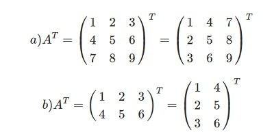

# Скаляры, вектора, матрицы, тензоры
**Скаляр** - это величина, полностью определяемая в любой координатной системе одним числом или функцией. 
В ML же это можно интерпретировать как какой-то элемент множества.

**Вектор** - это набор элементов, расположенных друг за другом.
### **Матрица**
> Это 2D таблица данных, характеризующаяся столбцами и строками.

Операции с матрицами:

- **Транспонирование -** относительно главной диагонали ( на рисунке ниже это \ из 1 5 9 и 1 5 соответственно) происходит переворот значений
    
    
    
    
**Тензор** - это некоторый математический или физический объект, описываемый более чем 2-мя измерениями совокупности данных.

# Ряды
> **Математически** это некоторый упорядоченный ряд чисел, который, очевидно, можно описать однозначно определённой формулой.

Характеристики
- Сходимость
- аут
## Ряд Тейлора
> da
### Ряд Маклорена (частный случай ряда Тейлора)