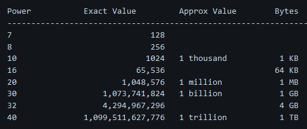

--- 

# Important numbers to know

## Powers of 2

> 1 kilobyte = 1024 bytes (not 1000), то же самое с градациями выше… 
> Под power - имеется в виду степень… степень 2^n. Т.е. (Power 10) → 2^10, что, к слову, равно 1024. 
> Поэтому разрядность рассматривается не как 1, 1000, 1 000 000… А как 2, 2^10, 2^20 и т.п.

## Bytes grade

| Power | Appoximate Value        |               | Full name  | Short name |
| ----- | ----------------------- | ------------- | ---------- | ---------- |
| 10    | ~1 000                  | 1 thousand    | 1 Kilobyte | 1 KB       |
| 20    | ~1 000 000              | 1 million     | 1 Megabyte | 1 MB       |
| 30    | ~ 1 000 000 000         | 1 billion     | 1 Gigabyte | 1 GB       |
| 40    | ~ 1 000 000 000 000     | 1 trillion    | 1 Terabyte | 1 TB       |
| 50    | ~ 1 000 000 000 000 000 | 1 quadrillion | 1 Petabyte | 1 PB       |

## Latency numbers

| Operation name                        | Time                    |
| ------------------------------------- | ----------------------- |
| L1 cache reference                    | 0.5 ns                  |
| Branch mispredict                     | 5 ns                    |
| L2 cache reference                    | 7 ns                    |
| Mutex lock/unlock                     | 100 ns                  |
| Main memory reference                 | 100 ns                  |
| Compress 1K bytes with Zippy          | 10,000 ns = 10 µs       |
| Send 2K bytes over 1 Gbps network     | 20,000 ns = 20 µs       |
| Read 1 MB sequentially from memory    | 250,000 ns = 250 µs     |
| Round trip within the same datacenter | 500,000 ns = 500 µs     |
| Disk seek                             | 10,000,000 ns = 10 ms   |
| Read 1 MB sequentially from network   | 10,000,000 ns = 10 ms   |
| Read 1 MB sequentially from disk      | 30,000,000 ns = 30 ms   |
| Send packet CA->Netherlands->CA       | 150,000,000 ns = 150 ms |

# Usual hardware restricts
* HDD - write - 20...200 MB/s
* SSD - write - 460..5000 MB/s (idk, could new gen SDD with 11k be used for that)

# Speed measurements
* Server throughput - RPS
* DB throughput - QPS
* Data throughput - B/s
* Latency