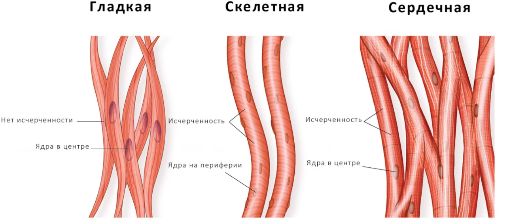

# Термины
- **АТФ** ~ **энергетическая валюта** для всякого рода **клеток**
- **Миология** - наука о мышечной системе с точки зрения анатомии, патологии, функциональности и т.п.
- **ацидоз** - в крове больше кислотности чем нужно
# Чё т про деление клеток
> Есть разные типы, кто-то постоянно делится, кто-то по ситуации
- **потребляет** АТФ (энергия), аминокислоты и нуклеотиды (строительные блоки) и т.п.
- могут **триггериться сигналами соседних клеток** (ранение -> выделение `цитокинов`, а они заставляют делиться)
- **могут быть заблокированы** специальными белками
- слегка "дорогой процесс" - во время деления клетки временно не функциональны
# Типы
- **гладкие** - обычно вокруг органов и стенок сосудов
	- обычно медленные сокращения
	- не контролируются явно
	- **клетки делятся** (реген)
- **сердечные** - отдельная группа мышц в сердце
	- оч шустрые
	- не контролируются никак
	- **двигаются строго за счёт своих клеток** - pacemaker'ов, они задают ритм
		-  под капотом там ионные каналы, накопление зарядов, и переключения при определённых порогах и т.п.
		-  потребляют АТФ
		- `Синотриальный узел` в правом предсердии (60-80 уд/мин)
		- есть запасные варианты:
			- `Атриовентрикулярный узел` (40-60 уд/мин)
			- `Волокна Пуркинье` (20-40 уд/мин)
	- клетки **почти не делятся**.. погибли клетки? - замены нет (инфаркт)
	- немного обособленное строение ради реактивности импульсов
- **скелетные** - буквально все мышцы, что мы можем по желанию сгибать, разгибать, напрягать и т.п.
	- шустрые
	- контролируются явно
	- **плохо делятся**, но есть **клетки-сателиты** (частично реген)

- **исчерченность** ~ скорость работы волокн
	- составлены из `актин`а и `миозин`а, они уложены строгими рядами для мгновенных сокращений
- **положение ядер** ~ спецификация восстановления (регенерация)
	- ядро "обслуживает"  кусок волокна, отвечая за синтез белка и некоторого рода "инструкции" как-что... дальше уже контекст РНК, ДНК и т.п.
- всякое мышечное **волокно окружено капиллярами, которые поставляют кислород, глюкозу и аминокислоты**
	- глубина поставки ~0.1мм вглубь волокн
---
# Тренировки
## Микротравмы
- Тренировка = **микротравмы**, они не разрушают ядра на краю, это просто надломы в волокне
- **Восстановление** идёт за счёт спец. клеток - `сателитов` (англ. спутники), которые лежат вне волокна
- Сателиты копируются/делятся и **вливают свои ядра в волокна**
- Волокна становятся **насыщеннее ядрами** и больше (`гипертрофированность`) -> теперь волокно **может синтезировать больше белка**
	- исчерченность, положение ядер и длина волокон **не меняется**
	- толстые волокна **сложнее кровоснабжать** + глубина поставки капилляров ограничена
	- в покое более тонизирована и сложнее порвать
	- снижается эластичность
> если много тренироваться, сателиты истощаются (не до конца офк), восстанавливать травмы нечем = один из симптомов **перетренированности**
## Проблемы поставки АТФ
- **если кислороод в клетках волокна заканчивается**, то клетки переключаются на бескислородный (`анаэробный`) `гликолиз`, энергии становится **в 18 раз меньше**
- анаэробный гликолиз -> *пируват* + *ионы водорода*
	- накопление ионов = жжение в мышцах (тут уже чистая химическая проблема)
	- чтобы мышца не закислилась сразу, организм синтезирует: *пируват* -> **лактат**
		- при этом лактат забирает протоны из ионов водорода -> снижение жжения
	- лактат = *молочная кислота*
	- много ионов водорода = больше кислотность в крови = *ацидоз*
- **длительное кислородное голодание** = **разрушение** миофибрил (`атрофия` центра волокна)
	- миофибрил - тонкая нить внутри волокна, высокая плотность мышц - это про вот это..
- **решение - построить новые капилляры**, это триггерится через спец. белок, который заставляет ближайшие капилляры ветвится
	- слишком толстые волокна это не спасёт, а это всё та же огромная проблема с выносливостью
## Аспекты строения
- **эластичность** - целиком и полностью выстраивается за счёт адаптации (т.е. растяжка)
	- `белок титин` - практически пружина вот в узорах исчерченности, которая не позволяет волокнам рваться
	- **соединительная ткань** вокруг волокон:
		- коллаген - если слишком много - рубец, эластичность хуже
		- эластин - если много - эластичность лучше - обычно много в связках
	- `цитоскелет` - внутренний каркас клетки некоторых белков
- **выносливость** 
	- `митохондрии` - **электростанции клетки**, технически глкоза и кислород попадают сюда, а выходит отсюда уже **АТФ** 
	- **капиллярная сеть**, если волокна не слишком толстые особенно
	- есть **прям медленные мышцы**, которые напичканы митохондриями по умолчанию
	- `миоглобин` - белок, который запасает кислород внутри мышц (из-за него обычно мышцы красные)
## Если совсем порвать...
- если совсем порвать мембрану вокруг волокн (это уже полноценные **разрывы мышц**) - то содержимое у волокн вытекает наружу.. 
- организм считает это инородным и заливает коллагеном -> остаются **рубцы**
- технически это **ухудшение качества мышц** на всю жизнь...
- **организм может компенсировать** это тем, что соседние волокна становятся толще и берут нагрузку на себя, а сателиты могут попытаться прорасти внутрь рубца
	- но штраф на силу всё равно будет
	- штраф на эластичность
	- шанс повторного разрыва выше
## Аспекты силы
- как много нервная система может включить **моторных единиц**
	- `мотонейрон`ы содержатся в спинном мозге, от них до мышц идут `аксон`ы (как кабели)
	- сигнал по аксонам идёт к `нейромедиатор`ам, которые распрастраняют сигнал по мышце (сокращение)
	- **характеристики**:
		- **кол-во** участвующих мотонейронов в процессе
			- если лёгкий вес - мало участвуют
			- выше тренированность - больше мотонейронов включается
		- **частота импульсов** - тоже тренируемо
			- сильное сокращение = высокая частота
		- **синхронизация** - обычно резкость движения - одновременное включение всех возможных мотонейронов
- **координация мышц-антагонистов** - это скорее исключение мешающих движению смежных групп мышц из движения
- **плотность миофибрил** - ближе к "дано от природы"
- тренированность рычагов - **крепления сухожилий** - частично тоже затрагивает "дано от природы"
- **внутримышечная координация** - тренированность
##  Типы воздействий
> В формате 1 vs 1
### Динамика
> Сокращение + расслабление, иногда натяжение
- Технически... всё описание в этом файле целиком про динамику..
- **Микротравмы** в основном имеют механический фактор (сильно волокно потянул, например...)
- На гипертрофию тут наибольшая склонность...
	- большая амплитуда - много участков для травм
	- расстяжение больше - травмы вдоль всего волокна
	- механическое повреждение - само по себе весомее
### Статика
> Мышце очень часто шлётся сигнал напряжения - `тетаническое усилие` (*лат. тетанус - оцепенение*)
- Нервная система тренируется в тетаническое усилие
- Капилляры пережимаются
	- **кровь проходит хуже** -> а это мало продуктов обмена и кислорода
	- так мышцам **очень легко дойти до анаэробного гликолиза** -> *гипоксия*
- Нервная система **очень активно учится включать больше мотонейронов**
	- ..но учится это делать на конкретных углах, а не во всей предполагаемой траектории движения
- **Микротравмы** - тут больше биохим. фактор
	- Есть спец. сократительные белки: *актин* и *миозин*, они внутри *миофибриллы*. 
		- Они часто соединяются и разъединяются... Тут есть всякие структуры мостиков...
			- Для работы нужно: АТФ, кальций и магний
				- если АТФ мало - ухудшается контроль кальция -> склонность к сбоям
				- сбои = большая нагрузка = мостики часто ломаются = *микротравмы*
		- Глубже тут смотреть смысла совсем нет...
## Pump
> "Памп" мышц ~ предельный режим работ для мышцы
- Рано или поздно мышца приходит к анаэробному гликолизу
	- в процессе всё же есть молочная кислота, она провоцируют расширение сосудов = сильнее кровоток
	-  
- Мышца:
	- забита кровью
	- мало кислорода
	- много метаболитов (всякого рода вещества метаболизма)
- усилевается синтез белка
---
# Связки
- Исключительно "пассивный трос" <кость>-<кость>, который держит кости в суставе и защищает от неествественных углов
- **Нет исчерченности, сателлитов** и прочего из мышц
- Много **коллагена** I-типа (прочные на разрыв) и **эластина** -> **эластичные**
	- ну вообще из `фирбобласт`ов, с возрастом они всё менее активные - снижается плотность и упругость
		- **фирбобласты** - отвечают за синтез **коллагена**, **эластина** и **гиалуроновой кислоты**
- **Капилляров почти нет** -> беды с кровоснабжением и прям ужасный реген (ну и белоснежного цвета)
	- **недели и месяцы регена** VS пара дней регена микротравм миофибр
- Всякого рода **поступление** аминокислот, кислорода и прочего строго через обычную **диффузию из ближайших тканей** (авось всосётся, авось нет...) 
## Сухожилия
- "Трос" <мышца>-<кость>, мышца сокращается и через сухожилия тянет за собой кость
- Почти целиком **коллаген** I-типа -> **почти не эластичные**
- Всё также нет исчерченности и прочего + капилляров почти нет (тоже белоснежного цвета)
---
# Атрофия
> Волокна становятся меньше, меньше белка и митохондрий
- почему? - логика в "зачем держать и обеспечивать дорогие мышцы"
---
# Потребление веществ
- [Про вещества см тут](./metabolism.md), но напомню:
	- глюкоза даёт быструю энергию
	- жиры для взрывного не очень
	- кислород нужен для эффективного синтеза АТФ
	- соли влияют на сокращение и расслабление мышц
	- закон осмоса - попытка выровнять концентрацию перекачкой воды
	- радикалы - свободные молекулы, что всё дамажат
## Спорт. пит.
### Креатин
> В организме он есть, мы его просто поставляем внутрь разными обёртками.
> По сути, это просто улучшение для "переиспользования" клетками АТФ.
- В мышце есть вещества:
	- `фосфокреатин` - фосфат + креатин
	- свободный креатин
	- фермент `креатинкиназа` - его задача к свободному креатину подцепить фосфатную группу
- **АТФ -> АДФ + фосфат + энергия** (для работы/сокращения мышцы)
	- АДФ - это буквально АТФ без фосфата
- **Фосфокреатин + АДФ -> креатин + АТФ**
	- т.е. фосфокреатин восполняет "использованной АТФ" (АДФ) обратно фосфат, перезаряжая его, по сути...
- Концентрация креатина внутри клетки растёт, вне клетки её мало, тут по **закону осмоса** в клетку закачивается больше воды, клетка становится "сочной.."
	- из **побочного** тут только общее **повышение веса**
- креатин + вода -> **креатинин**
	- необратимая реакция, это вот потом выводится с мочой из организма
- поставка в организм
	- креатин с молекулой воды - моногидрат
	- креатин с хлором и водой - гидрохлорид, чуть лучше усваивается чем моногидрат, проще людям с чувствительным организмом
### Протеин
> Более **простая для пищеварения форма белков**
- если не добираем норму белка - довосполняем её протеином
- любое восстановление волокн после тренировок (микротравм) требует белки для синтеза
### Аминокислоты
> Очень разного рода **строительные материалы**...
- Сократительные белки (актин, миозин) - это вот волокна миофибрил
- Каркасные белки (титин, десмин) - из аспекта про эластичность
- Ферменты (креатинкиназу, гликогенсинтазу) - это вот про атф-операции
- Рецепторы и ионные каналы - немного "low-level" с электродинамики организма
- и т.д.
#### BCAA
> Лейцин + Изолейцин + Валин
- **лейцин** - активатор синтеза белка
- **изолейцин и валин** -> глюконеогенез -> глюкоза
- все 3 аминокислоты мы получаем постоянно в избытке, поэтому это **около-бесполезно**
	- мб полезно, если:
		- тренировка натощак
		- вегетарианцам
		- по какой-то причине организм экономит белок (генетическая проблема)
### Изотоники
> Вода + сахар + соли (калий, магний, натрий)
- по сути, быстрая натуральная подпитка...
### Кофеин
> TODO - описать в другом месте.
- В течение дня накапливается аденозин...
	- чем его больше, тем уставшее мы себя чувствуем.. 
	- но ему для этого надо осесть на рецепторы. 
- Кофеин - похожее на аденозин вещество, которое временно садится на рецепторы вместо него, поэтому это просто **блокировщик усталости**.
### misc
- **глютамин** - аминокислота для стамины.. 
	- итак синтезируется организмом в огромных кол-вах, **создать его дефицит именно тренировками нельзя**
	- но такое полезно при прям травмах, ожогах и кишечных заболеваниях
- **l-карнитин** - **маркетинг**, предполагается, что спец. молекулы отправят жиры на окисление в митохондрию
	- .. но на деле в клетку попадает лишь 10-20% карнитина, а мышечная клетка от этого <10% поглащает
	- может быть поможет только вегетарианцам
- **чем регенить связки?** 
	- Пить аминокислоты для восстановления связок и сухожилий почти бессмысленно, от обычной еды коллагена генерится достаточно, его дефицит тренировками не создать...
	- Помогает слегка другое и именно в долгосрочной перспективе:
		- `гидролизованный коллаген` - это белковые кусочки `пептиды`, работают как фермент-триггер
			- .. как только фирбобласты видят кучу кусочков коллагена в крови, то в ответ на фейковый распад коллагена они синтезируют новый
		- `витамин С` 
			- кофактор для ферментов для синтеза коллагена
			- при микротравмах образуются свободные окислители, которые вызывают жжение и т.п., витамин С - тут выступает в качестве *антиоксиданта*
---

# Мышечная анатомия
> Офк что-то общее...
## Быстрые/медленные волокна
> Примерная их природа к этому моменту должна быть понятна...
- Везде разные пропорции
	- очень сильно зависит:
		- от генетики
		- от адаптаций (и тренировок офк)
### Медленные
- куча митохондрий
- много капилляров
- много миоглобина (спец. белок для запасания кислорода)
- мало ацидоза
- Кто?
	- постуральные мышцы (держать осанку, стабилизировать...)
		- вся шея
		- большая часть мышцы спины
		- камбаловидная (на икрах) - держат стоя
### Быстрые
- меньше митохондрий
- больше диаметр волокн
- меньше капилляров
- хуже кислородная инфраструктура
- Кто?
	- ягодицы
	- квадрицепсы
	- грудные
	- широчайшие
	- трицепс
	- икроножные - прыжки, ускорение
## Спина
> Стаб = стабилизатор

### Поверхностные
> Двигать плечи и лопатки
- трапеция
	- держать и тянуть лопатки
	- поднимать плечи
	- стаб шеив
	- медленные волокна
- широчайшие
	- тянуть руки вниз & назад & к телу
	- огромная площадь и рычаги
	- чуть больше быстрых волокн
	- работает в ходьбе и беге
	- соединяет позвоночник, плечо и таз
- ромбовидные
	- стабы лопаток
	- тянуть лопатки назад и друг к другу
	- больше медленных волокн
### Глубокие
> Держать позвоночник
- разгибатели спины
- мультифидусы
- короткие стабилизаторы
### Манжета плеча
> Стабы плеча
- надостная
	- первые градусу подъёма руки
	- часто воспаляется или пережимается
	- работает в очень узком пространстве
- подостная
	- вращение плеча наружу
	- стаб плеча - всякие удержания
- малая круглая
	- саппорт для подостной
---
