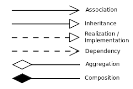
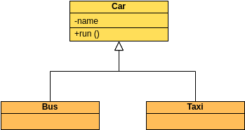
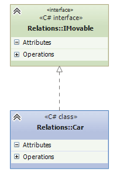
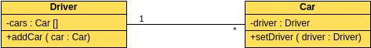
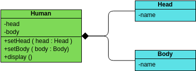
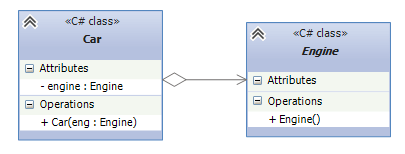
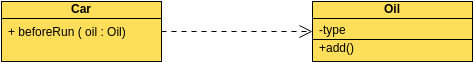

💡 Определения парадигмыи  из интернета я переписывать не буду… Но…

Полиморфизм - многоформенность некоторого метода или сущности, что за дичь, да?
Есть статический полиморфизм и динамический. Рассмотри частный случай статического полиморфизма - перегрузки.

```cpp
int Sum(const int a, const int b)
{ 
	return std::accumulate(a, b);
}

int Sum(const double a, const double b)
{
	return std::accumulate(a, b);
}
```

Как бы вызов и так, и сяк будет для 2 чисел, но одна и та же функция может работать с разными объектами… вот и описание понятия полиморфности. Почему это статически? - Потому что компилятор всё это видит и “понимает, что тут происходит”.

# Отношения между классами

[https://prog-cpp.ru/uml-classes/](https://prog-cpp.ru/uml-classes/)



## Inheritance

> **Наследование →** ребёнок наследует возможности класса родителя



```java
public class Car
{
	public void run() {};
	private String name = "Car";
}

public class Bus extends Car { /* could run */ }
public class Taxi extends Car { /* could run */ }
```

## Implementation

> Реализация/Внедрение предполагает, что есть интерфейс класса, а его реализация находиться, например, в другом классе.. в основном используется для указания **связи между интерфейсами и классами реализации**



```java
public interface IMovable { 
	void Move();
}

public class Car implements IMovable {
	void Move() { 
		System.out.println("I moved"); 
	}
}
```

## Association



**Ассоциация** - объект одного типа содержит или использует объект другого типа, отношения типа один ко многим

```java
import java.util.ArrayList;

//
// 1 driver has a lot of cars
// and 1 car has 1 driver
//

public class Driver
{
	public void AddCar(Car car);
	
	private ArrayList<Car> cars; 
}

public class Car 
{
	public void SetDriver(Driver driver);
	
	private Driver driver;
}
```

На диаграммах UML двунаправленные ассоциации могут иметь **две стрелки** или **не иметь стрелок** , а односторонние ассоциации или самоассоциации имеют **стрелку** .

В отношении множественности вы можете добавить число непосредственно к 
связанной строке, чтобы указать количество объектов в соответствующем 
классе.

- `1..1`: Единственный
- `0..*`: ноль или больше
- `1..*`:один или больше
- `0..1`: Нет или только один
- `m..n`: не менее m, не более n (m<=n)

## Composition

**Композиция** - отношение типа 'has a'… например, автомобиль содержит двигатель, двигатель **в полном подчинении** класса авто 



```java
public class Human 
{
	public void SetHead(Head head) {}
	public void SetBody(Body body) {}
	public void Display() {}
	
	// но используемы...
	private Head head;
	private Body body;
}

// сами по себе не конструируемы
public class Head {
	private String name = "head";
}

public class Body {
	private String name = "body";
}
```

## Argeration

> **Агрегация** - частный случай композиции, однако класс используемый другим классом по факту “равноправен” ему и может существовать сам по себе.
> 

Обычно ссылка не на сам класс, а не его интерфейс для гибкости.



```java
public class Car
{
	public void Car(Engine eng) {} // .. и использоваться
	
	private Engine engine; // но может храниться..
}

public class Engine
{
	public Engine() {} // он сам по себе конструируем
}
```

## Dependency

> Зависимость подразумевает использование объекта одного класса другим классом.



```java
public class Car
{
	public void BeforeRun(Oil oil) {}
}

public class Oil<T>
{
	public void Add() {}
	
	private T type;
}
```
