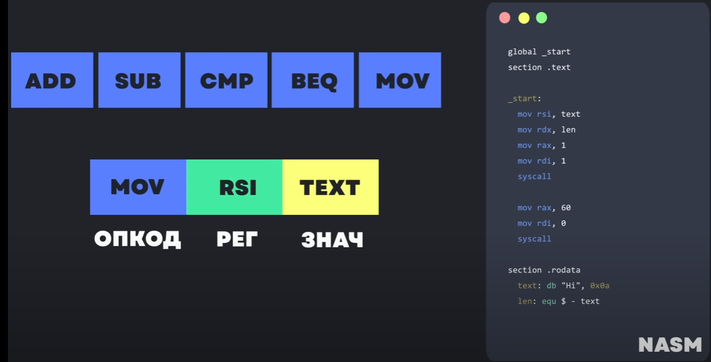

> Это представление команд процессора в виде, доступном для чтения человеком. Язык ассемблера считается **языком программирования низкого уровня**, в противовес высокоуровневым языкам, не привязанным к конкретной реализации вычислительной системы. Программы, написанные на языке ассемблера однозначным образом переводятся в инструкции конкретного процессора и в большинстве случаев не могут быть перенесены без значительных изменений для запуска на машине с другой системой команд. 
> **Ассемблером** называется программа, преобразующая код на языке ассемблера в машинный код; программа, выполняющая обратную задачу, называется **дизассемблером**.

Если когда-нибудь придётся читать ассемблер (на самом деле понимать, как код будет выглядеть в ассемблере… писать на ассемблере не надо…), то:

- add - операция прибавления

*ADD СУММА, ЧИСЛО -* С помощью этой команды можно сложить два числа: **СУММА** и **ЧИСЛО** складываются, а результат помещается в **СУММУ**.

```nasm
MOV AL, 5   ; AL = 5
ADD AL, -3  ; AL = 2
```

- sub - вычесть

*SUB РАЗНОСТЬ, ЧИСЛО - С помощью этой команды можно из РАЗНОСТИ вычесть ЧИСЛО. Результат помещается в РАЗНОСТЬ.*

```nasm
MOV AL, 5   ; AL = 5
SUB AL, 1   ; AL = 4
```

- cmp - сравнить

*CMP ЧИСЛО1, ЧИСЛО2* 

1. Из ЧИСЛА1 вычитается ЧИСЛО2 (ЧИСЛО1 - ЧИСЛО2)
2. Если результат равен нулю, то ЧИСЛО1 = ЧИСЛО2
3. Если числа равны, то есть результат равен 0, то устанавливается флаг ZF
4. Прочитать флаг ZF
5. Если ZF = 1, то числа равны
6. Если ZF = 0, то числа НЕ равны

```nasm
MOV AL, 5   ; AL = 5
SUB AL, 1   ; AL = 4
```

- beq - ветвление

*BEQ ЧИСЛО1, ЧИСЛО2 МЕТКА - если ЧИСЛО1 равно ЧИСЛО2, то переходит по метке*

```nasm
MOV AL, 5
MOV RAX, 10
BEQ AL, RAX, Label
Label:
;<какой-то код>
```

- move - перемещение

*MOV ПРИЁМНИК, ИСТОЧНИК -* С помощью этой команды можно переместить значение из *ИСТОЧНИК* в *ПРИЁМНИК*. То есть по сути команда **MOV** копирует содержимое *ИСТОЧНИК* и помещает это содержимое в *ПРИЁМНИК*.

```nasm
MOV AL, 5
```

- jmp - безусловный переход по метке (как goto в с++)
    
    ```nasm
    JMP Label_2
    Label_1:
    ;<какой-то код>
    Label_2:
    ;<какой-то код>
    JMP Label_1
    ```
    



<aside>
💡 Классный сайт для того, чтобы перевести код из одного ЯП в другой… Но тут есть и ассемблер =). Можно посмотреть как высокоуровневый код будет выглядеть в машинном коде:
[https://godbolt.org/](https://godbolt.org/)

</aside>