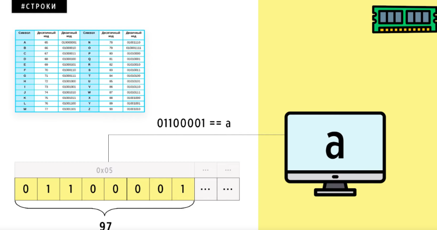

> Строки лежат в памяти так же, как и числа, т.е. в бинарном виде. Однако при обращении к ним как к набору символов применяются таблицы кодировок.

---

# ASCII

Первым появившимся стандартом кодировки был **ASCII7** (**American standard code for information interchange 7 bits**). Который вмещал весь необходимый набор только лишь символов латиницы и некоторых служебных в 7 бит - 128 значений, где первые 31 выделялись под управляющие символы.

# ASCII8

Для решения проблемы того, что ASCII7 был ориентирован только лишь на латиницу, в стандарт было добавлено использование ещё 1 бита, где 128 значений соответствовали ASCII7, а ещё 128 значений (2^8 - 128) заполнялись уже каждой страной. Однако делалось всё это не стандартизировано, да и многие символы других языков всё равно туда не влезают. 

# ANSI

Для решения вопроса стандартизации дополнительных символов для каждой страны был придуман стандарт **ANSI** (**American National Standards Institute**). Где добавляется такая вещь, как **кодовая страница**, которая представляла собой указание, какого рода символы (какой страны, например) будут использоваться при кодировке. Однако проблему это особо не решило, т.к. восточные страны имеют более тысячи иероглифов, когда всё ещё используется расширенная модель ASCII с лишь 256 значениями. Тогда добавили возможность хранения некоторых символов по коду страны в 2 байтах (уже 65536 значений), однако каждый продолжал использовать уже свои сфомрированные дополнительные символы, проблемы стандарта это не решило.

# Unicode

Была создана динамически расширяющаяся таблица кодировки **UNICODE**, где символ минимум представлялся 2 байтами, первые 128, как обычно, соответствовали ASCII, однако после 2 байт имелась возможность добавлять новые символы. Т.е. появились и версии UNICODE. 

Но обработка таких огромных значений требовала немалых ресурсов ПК.
В памяти ПК строки могут располагаться как в прямом порядке (**big endian**), так и в обратном (**little endian**).

# UCS-2

Решение проблемы UNICODE с порядком байтов строки в памяти привело к созданию кодировки **UCS-2** (**Universal coded character set**). Суть которой заключалась в добавлении **BOM-байтов** перед строкой, которые характеризовали порядок байтов (big endian или little endian). Однако это добавление ещё 2 байтов к уже и так жирному UNICODE.

# UTF-8

Зачем было использовать UNICODE и UCS-2 в США, если им нет смысла использовать больше, чем свои 128 символов ASCII? Для решения обоих проблем UNICODE была придумана кодировка **UTF-8** (**Unicode transformation format 8 bit**), где минимальный размер символа составлял 8 бит, однако при необходимости мог расширяться до 4 * 8 бит (т.е. от 1 до 4 байт). Как понять, что кодировке достаточно будет 1 байта для распознания символа? - Для этого добавлялась маска, указывающая, сколько байт занимает текущий символ и в каком порядке лежат байты (big endian or little endian).
Little endian - начинается с 10.
Big endian - начинается с одной из этих кобминаций:

Однако в такой кодировке добавляется операция проверки длины символы, поэтому код стал работать медленее.

# UTF-16

Для создания текущего расширения кодировки были предъявлены требования в виде хранения символов в более чем 2 байтах и совместимости со старгыми кодировками. Появилось такое определения как **суррогатная пара**.

Если для символа предоставляется более 2 байт, то кодирвока считает, что оно закодировано суррогатной парой. В этой кодировке есть неиспользуемые для кодировки коды. В примере ниже происходит следующее:

- берётся символ юникода u+10459, на который требуется 3 байта
- из него в 16-ричной системе счисления вычитается 10000 и добавляются 0 для того, чтобы получить 20 байт
- происходит разбиение на 10 байт и к каждой такой части прибавляются 0xD800 и 0xDC00
- получаем число, которое как раз попадает в этот неиспользуемый диапазон кодов кодировки, тогда из памяти нужно прочитать 4 байта, иначе нужно считать 2 байта.

Таким образом BOM-байты остались, место кодировка стала занимать больше, однако работает кодировка быстрее UTF-8.

# UTF-32

В качестве продолжения решения скорости работы кодировки появился стандарт **UTF-32**, в котором каждый символ лежит обязательно в 4 байтах, скорость работы заключалась в том, что можно просто скакать по 4 байта и быстро считывать символы.

---

# Примечания

💡 UTF-8 из-за малых затрат памяти используется для передачи файлов по интернету, UTF-16 и 32 используется из-за скорости в ЯП

💡 В каждом ЯП строки немного отличаются по способу хранения и представления. Например, в Си есть свои строки **Си-строки**, где каждый символ лежит в 1 байте, строки сами "бесконечные", но в конце есть **терминирующий ноль**, который нельзя использовать в качестве символа. Скорость доступа к элементам такой строки не очень высокая.

💡  Для *терминологии*… **сложение двух** строк называется **конкатенацией**.