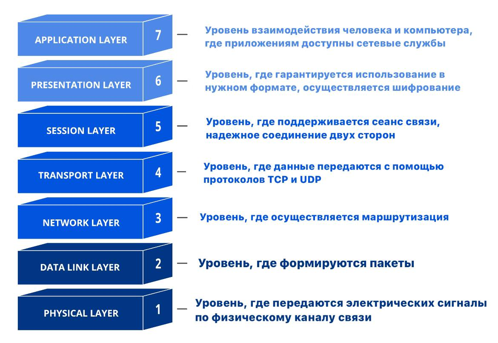

 > **Модель OSI** представляет собой концептуальную платформу, которая разделяет функции сетевой связи на семь уровней. Посредством данной модели различные сетевые устройства могут взаимодействовать друг с другом. Модель определяет различные уровни взаимодействия систем. Каждый уровень выполняет определённые функции при таком взаимодействии.

Соответственно, в данной модели представлены уровни передачи информации от физического взаимодействия “кода” и интерфейсов ПК до клиента/хоста.

- **Physical Layer** - Физический уровень
    
    Передача сигнала от “кода” до каналов связи типа Ethernet и т.п. Происходит непосредственно передача сигнала под требуемый протокол (Формирование сигнала для Bluetooth, Wi-Fi и т.п. тоже сюда входит).
    
    **На выходе**: определённым образом сформированные сигналы.
    
    **Примеры устройств** на этом уровне: кабели Ethernet, BlueTooth и Wi-Fi модули, концентраторы (hub) и репитеры (repeaters).
    
- **Data Link Layer** - Канальный уровень
    
    Происходит формирование битовой информации с использованием сигналов с физического уровня (информация представлена в виде эл. волн с разными характеристиками). Такими пакетами информации называются Frame’ы. В них содержится дополнительная служебная информация помимо передаваемой информации (а-ля кому и от кого). Здесь присутствует проверка правильности передачи данных. 
    
    **Необходимые идентификаторы**: MAC-адрес.
    
    💡 MAC-адрес - адрес конкретного устройства в рамках канального уровня. Формат: 00:16:52:00:1F:01

    **Протоколы:** PPP, CDP, MPLS…
    
    **На выходе:** бинарные пакеты - frames.
    
    **Примеры устройств** на этом уровне: кабели Ethernet, коммутаторы, мосты.
    
- **Network Layer** - Сетевой уровень
    
    Добавление в frame с канального уровня служебной информации (отправитель, получатель и т.п.) для уже сетевого уровня (не внутри машины). По факту этот уровень решает задачу маршрутизации уже в рамках сети. 
    
    💡 Здесь же и происходит работы команды PING, а также происходит обращение к DNS.

    💡 DNS - некоторый модуль в сети, который выдаёт в ответ на запрос, например, [https://gmail.com/](https://gmail.com/) чистый IP-адрес этого сайта, по которому уже и происходит переход.
    
    **Необходимые идентификаторы**: IP-адрес.
    
    💡 IP-адрес - адрес устройства в контексте сети, к которой устройство подключено. Формат: 192.168.1.1
    
    **Протоколы:** ICMP
    
    **На выходе:** бинарные пакеты с уже сетевой служебной информацией.
    
    **Примеры устройств** на этом уровне: Маршрутизатор (Протоколы BGP, OSPF, RIP, EIGRP)
    
- **Transport Layer** - Транспортный уровень
    
    Отвечает за надёжную передачу данных от устройства отправителя до устройства получателя. Контролируется протоколами TCP/UDP. 
    
    **Протоколы:** TCP, UDP, TCP/IP…
    
    **На выходе:** получение пакетов данных получателем.
    
- **Session Layer** - Сеансовый уровень
    
    С данного уровня начинается непосредственно контроль передачи данных приложением. Образовывается некоторого рода сеанс/сессия между отправителем и получателем и указываются некоторые протоколы обмена для определённых сущностей (например аудио и видеокодеки совсем грубо говоря). Сеанс, естественно, можно и разрывать.
    
    **На выходе:** сформированный канал обмена данными между двумя устройствами.
    
- **Presentation** **Layer** - Уровень представления
    
    Происходит преобразование формата сообщений (Например, преобразование бинарного представления в формат изображения или видео). Сюда же можно отнести кодирование и сжатие.
    
    **На выходе:** данные, представленные в требуемом виде.
    
- **Application Layer** - Уровень приложения
    
    На этом уровне обеспечивается взаимодействие с сетевыми службами, позволяющими взаимодействовать с сетью. (Такие службы как telnet, lpd, tftp, nfs, dns, dhcp, snmp, xwindow и т.п.)
    
    **Протоколы:** https, smtp, ftp, http…
    
    **На выходе:** возможность работать с сетью с приложения.
    