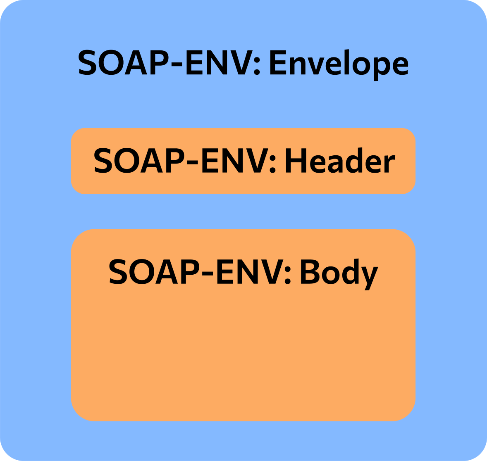
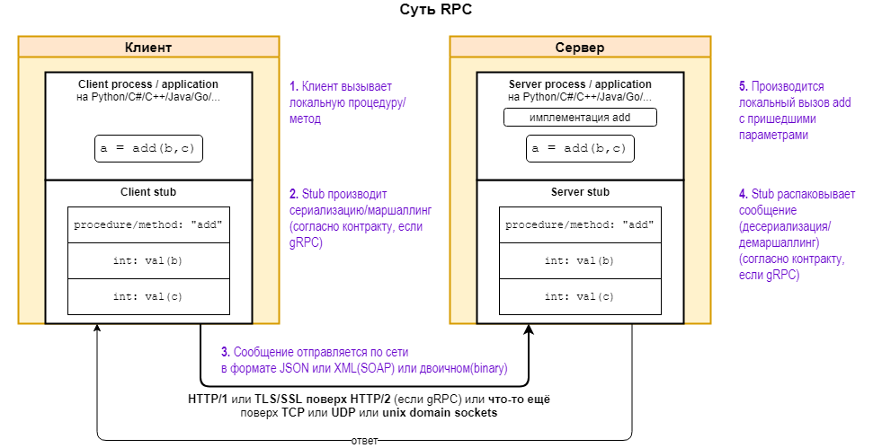

> **API (Application Programming Interface)** – это механизмы, которые позволяют **двум программным компонентам взаимодействовать друг с другом**, используя набор определений и протоколов. 
>Примерно как в программировании, у класса есть публичные функции, через них мы можем обращаться к объекту класса, это абстрактно и есть API.
# HTTP protocol
> **HyperText Transfer Protocol** - сетевой протокол прикладного уровня, изначально предназначенный для передачи HyperText Markup Language (**HTML**) файлов.
> "Изначально" - потому что сейчас HTTP используется в качестве "**транспорта**", а в своём теле могут передавать разного рода файлы, например, json в REST Api.

В голом виде HTTP запрос выглядит так:
```
GET /anydata HTTP/1.1  
Host: google.com
```
* `GET` - метод (здесь мы хотим получить данные)
* В первой строчке обязательно укзаывается версия HTTP протокола - `1.1`
* `/anydata` - **URI** (Uniform Resource Identifier) - унифицированный идентификатор ресурса, или некоторый путь до какого-то ресурса. 
Принимается запрос примерно в таком виде:
```
HTTP/1.1 200 OK
```
* 200 - **код состояния**
	Список всех кодов можно посмотреть тут -> https://ru.wikipedia.org/wiki/%D0%A1%D0%BF%D0%B8%D1%81%D0%BE%D0%BA_%D0%BA%D0%BE%D0%B4%D0%BE%D0%B2_%D1%81%D0%BE%D1%81%D1%82%D0%BE%D1%8F%D0%BD%D0%B8%D1%8F_HTTP
* OK - **Reason Phrase** - пояснение к нему
## Body response example
* Через 2 строчки следует HTML'ем тело.
* Стащил пример отсюда: https://habr.com/ru/articles/215117/
```html
HTTP/1.1 302 Moved Temporarily
Server: nginx
Date: Sat, 08 Mar 2014 22:29:53 GMT
Content-Type: text/html
Content-Length: 154
Connection: keep-alive
Keep-Alive: timeout=25
Location: http://habrahabr.ru/users/alizar/


<html>
<head><title>302 Found</title></head>
<body bgcolor="white">
<center><h1>302 Found</h1></center>
<hr><center>nginx</center></body>
</html>
```
## Запросы
* https://www.w3schools.com/TAgs/ref_httpmethods.asp
* Ещё один пример всего описания: https://selectel.ru/blog/http-request/#:~:text=%D0%97%D0%B0%D0%BF%D1%80%D0%BE%D1%81%D1%8B%20(HTTP%20Requests)%20%E2%80%94%20%D1%81%D0%BE%D0%BE%D0%B1%D1%89%D0%B5%D0%BD%D0%B8%D1%8F,%D0%B2%20%D0%BE%D1%82%D0%B2%D0%B5%D1%82%20%D0%BD%D0%B0%20%D0%BA%D0%BB%D0%B8%D0%B5%D0%BD%D1%82%D1%81%D0%BA%D0%B8%D0%B9%20%D0%B7%D0%B0%D0%BF%D1%80%D0%BE%D1%81.
## HTTPS
> То же HTTP, но с сертификацией TLS и SSL.
## REST API
> Representational State Transfer - набор правил проектирования api и работы с ним.
> Т.е. создаётся какой-то веб сервер, который умеет принимать http запросы и реализуется примерно такой интерфейс
```python
app = FastAPI()         # просто инстанс FastAPI фреймворка
router = APIRouter(prefix="/any_domain/api/v1")

app.add_router(router)  # объект маршрутизатор запросов

@router.get("")
def get_data():
	"""
	Спрашиваем у сервера http://any_domain/api/v1 
	  -> получаем данные json'ом
	"""
	return http_client.get_data()

@router.put("/add/{id}")
def put_data(id: int):
	"""
	Спрашиваем у сервера http://any_domain/api/v1/add/5
	  -> получаем ответ на то, добавились ли данные или.. нет?
	"""
	return http_client.add_data(id)

```
Основные черты:
* **Stateless** - каждый запрос никак информативно с другими не связан -> "каждый раз как в первый раз"
* Только HTTP методы и желательно CRUD семантики
* Обмен данными через json (а они плохо сжимаются), но также поддерживаются и другие
* Такой api легко реализовать, удобно использовать
* Сервер построенный на этих принципах именуют **RESTful**
Бизнес смысл:
* Легко внедрить
* Легко масштабировать
* Довольно стандартизированный и стабильный интерфейс (из определения + возможность возводить версии "рядом")
* Интероперабельность
### CRUD
> Базовый набор операций в API: создание, чтение, обновление (запись), удаление.
> Также подразумевает что-то вроде "Get запрос должен только менять данные", "PUT должен быть идемпотентен" и т.д.
* Идемпотентность - любое кол-во вызовов/запросов возвращает один и тот же результат


# SOAP API
> **SOAP API** – Simple Object Access Protocol, т. е. простой протокол доступа к объектам. Клиент и сервер обмениваются сообщениями посредством XML. 
> По факту это аналог REST API, однако это уже не набор правил, а строгий протокол.

Выглядит примерно так:

## Envelope
> Некоторый корневой элемент с мета информацией, содержащей так же целевой адрес
## Header
> Содержит всякие атрибуты сообщения, нужные для сервера или приложения: аутентификация, проведение платежей и т.п.
## Body
> В теле запроса используется язык разметки **WSDL (Web Services Description Language)**, основанный на HTML.
```html
<?xml version="1.0"?> 
<soap:Envelope xmlns_soap="http://www.w3.org/2003/05/soap-envelope/"                              soap_encodingStyle="http://www.w3.org/2003/05/soap-encoding"> 
	<soap:Body> 
		<m:GetPrice xmlns_m="https://online-shop.ru/prices"> 
			<m:Item>Dell Vostro 3515-5371</m:Item> 
		</m:GetPrice> 
	</soap:Body> 
</soap:Envelope>
```
## Fault
> Возвращается в качестве ошибки с атрибутами в теле: faultcode, faultstring (описание), faultactor (кто сгенерил ошибку), detail (доп. описание)
## Features
* Может работать с протоколами транспортного уровня
* Может быть stateless/statefull
* Так себе поддержка кэширования
* Довольно сложная можель безопасности
* Довольно ёмкие сообщения
* По выше перечисленному можно сказать, что такое используется обычно в банках
# WebSocket API
 > **Websocket API** - это еще одна современная разработка web API, которая использует объекты JSON для передачи данных. 
> Происходит подключение клиентов к серверу на длительное время. Таким образом обеспечивается двухстороння связь в "режиме реального времени".
### Features
* Используется в чатах, играх, брокерских сервисах и везде где требуется отслеживание чего-то в реальном времени
# GraphQL
> Протокол + БД, где клиенту для запроса данных нужно написать подобие SQL-запроса. 
> Таким образом можно вытаскивать с сервера конкретные данные, когда как в REST API, например, мы можем получать данные через установленный сервером интерфейс.
* REST  API -> хотим получить фото товара, название, артикул и наличие? 
* Но у сервера есть возможность вернуть либо Название+фото, либо Полное описание...
* Тогда придётся брать всё полное описание...
* В GraphQL пишем подобие SELECT ... WHERE и получаем ТОЛЬКО нужные данные (Нет, у него не SQL, это для примера)
## Основные черты
* Есть только **QUERY** (аналог HTTP-GET), **MUTATION** (аналог HTTP-POST), **SUBSCRIPTION** (своего рода подписка на события, реализованы через websocket)
* **Наследование**
* **Фрагменты** (смысл, как у переменных или скорее функций, что запросы можно сохранить в краткой форме и переиспользовать
* **Мутация** (просто запрос на модификацию данных)
### Features
* Очень примерный случай использование под сервис-магазин, где приходится вытаскивать конкретные "участки информации" о товаре в различных случаях
* Да, это удобнее REST API на бумаге, но работает далеко не так быстро и просто....
# RPC
 > Remote Procedure Call (RPC) - Механизм для удалённого вызова функций.
 > Клиент выполняет функцию (или процедуру) на сервере, и сервер отправляет результат обратно клиенту.
 > Обычно саму функцию упоковывают в JSON или XML и передают на сервер, сервер распаковывает и выполняет переданную ему процедуру. 




## gRPC
💡 [https://habr.com/ru/articles/787164/](https://habr.com/ru/articles/787164/)
> Написанная Google **альтернатива rpc**, где передаваемая процедура кладётся методами фреймворка в бинарный вид - **ProtoBuf'ы**, что значительно быстрее (10-20мс против 100-200мс с json/xml условно) + поддерживается разными языками программирования.
* Работает с HTTP 2, а не HTTP как, например, REST
* Поддерживает любые ЯП, код с помощь С-генератора преобразуется (сериализуется) в бинарный вид
* Бинарный вид хорошо сжимается, что сильно сказывается на скорости передачи на фоне json, например
* На выходе бинарный код преобразуется обратно (десериализуется) С-генератором в требуемые под ЯП инструкции и исполняется
Бизнес смысл:
* Тяжелее внедрять, но значительно быстрее
* Некоторые фреймворки всё же интероперабельны
* Проверка данных на этапе вызова из-за строгой типизации
### Features
* Довольно неприятно и долго встраивать на фоне, например, REST API
## tRPC
> Это то же самое, но встроенное в TypeScipt (это, если что, строго типизированный вариант JavaScript).