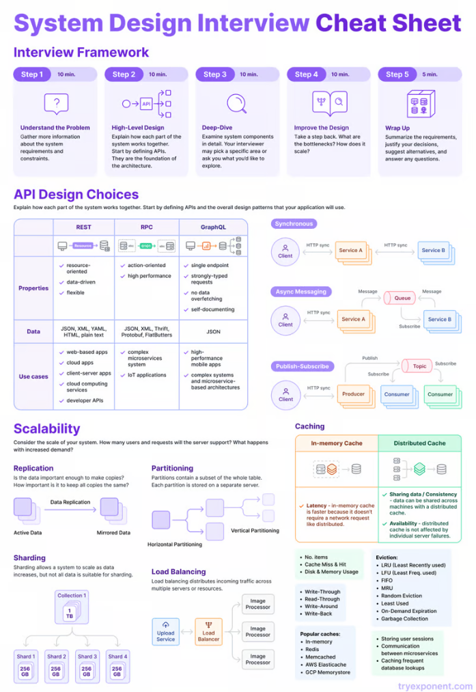

* Какие-то картинки и информацию я нашёл на просторах Яндекс Практикума в контексте архитектуры ПО. 
  Информацию я переформулировал и укоротил, а картинки вроде как ищутся поиском по фото в поисковике. 
  Но на всякий упомяну, что куда лучше и шире описано всё в самом курсе. 
  Получается, что это почти реклама...
# TODO
* Некоторые определения вынести сюда или в другие темы
* Вынести всю терминологию из файлов
# System metrics
> Основные параметры оценки системы

# System types
## Monolith
> Прям один большой единый сервис
### Modular Monolith
> Некоторый набор принципов по разделению логики в контексте всё того же монолита (т.е. какое-то разделение на сущности, фабрики и т.п. Но в той же кодовой базе)
# SOA 
> **Service-Oriented Architecture** - набор некоторых разделённых сервисов. Сервисы вполне могут быть связаны фиксированной шиной сообщений (или иным middleware), ощутимо зависеть друг от друга и т.п.
* В качестве **примера** это может быть системное приложение (например, антивирус) с несколькими `.exe`, где каждый исполняемый файл может представлять разные сервисы и т.п.
# Микросервисы
* [Microservices](resources/microservices.md)
* [Микрофронтенды](../frontend/resources/microfronts.md) - та же самая стратегия возможно и уже касательно фронтэнда

> Набор около-изолированных сервисов. Каждый сервис во многом независим от других или от какой-то среды. Хотя необходимость работать с чем-то из-вне как бы есть.
* Самый явный **пример** - контейнеры... в каждом контейнере принято хранить разные сервисы и БД, отдельно от них существует коммуникационный слой, хотя сервисы в контейнерах могут и прям по конкертному IP сами обратиться куда-то... 

# Targets

* **Границы сервисов** -> Необходимо понять какие основные бизнес-задачи (или домены) есть у приложения
* [Методы взаимодействия](resources/comunication.md)
* [Управление данными](resources/data-control)
* [Стратегии развёртывания](resources/deploy-strategy.md)
* [Балансировка нагрузки](resources/load-balancer.md)
* [Устойчивость к сбоям](resources/resilience.md)
* [Масштабируемость](resources/scalability.md)
* [Безопасность](resources/security.md)
* [Мониторинг](resources/monitoring.md)
* [Управление данными](resources/data-control.md)
* [API-менеджмент](resources/api-management.md)
* Тестирование и валидация
* [DevOps-практики](resources/devops.md)
* Версионарование и совместимость
### No idea where to stick it rn...
* [Немного про описание доступности](resources/availability.md)
* [Надёжность](resources/realiability.md)
* [Стратегии кэширования](resources/cache.md) (потом перенести в data-control)
# Load calculating
[All about service load calculating](resources/load-calculating.md)
# Terms
* Data PipeLine -> https://www.youtube.com/watch?v=kGT4PcTEPP8
* [CAP theorem](resources/cap-theorem.md)

# To-do
- [ ]  Оптимизация производительности
* [MVC](resources/mvc.md)

- SOA (Service-Oriented Architecture) vs Microservice vs Monolith
- Domain-driven design
- Event-driven подход
- Distributed Storage
- Infrastructure as Code
- Integration Patterns
- Monitoring?
- Cloud Architecture
- Realtime Architecture
- Service Mesh
- Микрофронты
- Highload
- Кэширование
- Контейнеризация
- Оркестрация
- БД...

# Какая-то небольшая шпора...

**полезные источники**
* [system-design-primer/README.md at master · donnemartin/system-design-primer](https://github.com/donnemartin/system-design-primer/blob/master/README.md#appendix)