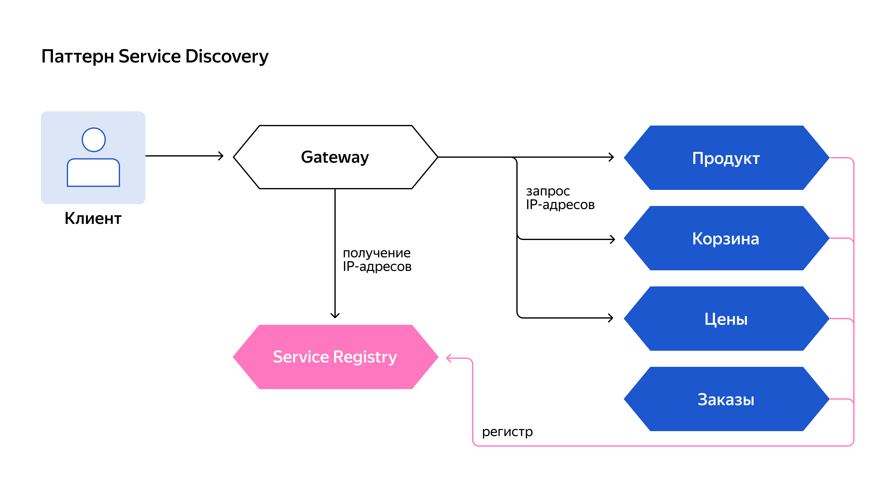
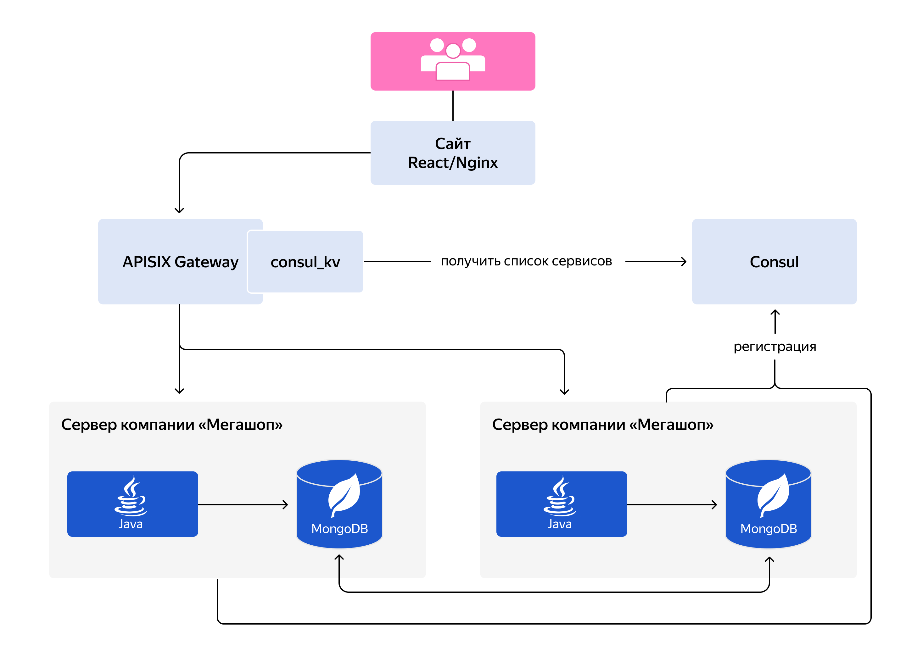

> **API** - application programming interface, если точнее просто интерфейс для чего-то (набор методов для работы)

**Обычно отвечает за:**
* За маршрутизацию запросов, в основном
* Аутентификацию и авторизацию запросов и пользователя
* Балансировку нагрузки иногда
* Безопасность с точки зрения самих запросов
* Логику кэширования
# Инструментарий
* API gateway
	* Kong
	* Apigee
* Документирование
	* Swagger
	* OpenAPI
* Проверка запросов
	* Postman
* Веб сервера
	* Nginx
	* HAProxy
# API Gateway pattern
> Паттерн проектирования или скорее обычай, где существует единая точка входа.
## Монолитный
> Просто один единый API, на которого и идут все запросы с клиента
* Единая точка управления всеми запросами
* Единая точка отказа...
* Могут быть проблемы с масштабированием
## Распределённый
> У каждого сервиса, например, может быть свой API, клиенту надо будет обращаться к конкретным API
* Удобно масштабировать
* Нет единой точки отказа
* Сложно решать вопрос с согласованностью данных
## Многослойный
> Объединение прошлых видов. Есть монолитный API, который обращается к каждому персональному для сервисов API.
* Хорошо почти всё, кроме...
* Большие затраты на инфраструктуру
* Сложно реализовать и настраивать
* Рост отклика
## Serverless
> С использованием облачного провайдера...
* Легко масштабировать и управлять
* Малые затраты ресурсов
* Полная зависимость от поставщика
* Возможны функциональные ограничения
# Service Discovery
> Паттерн проектирования, в котором существует прослойка регистратора сервисов. 
> API Gateway может просмотреть у этого компонента информацию и зарегестрированных сервисов и обратиться.

## APISIX Gateway
> Инструментарий для API Gateway с Service Discovery, где за последнее отвечает некоторый open-source компонент Consul.

