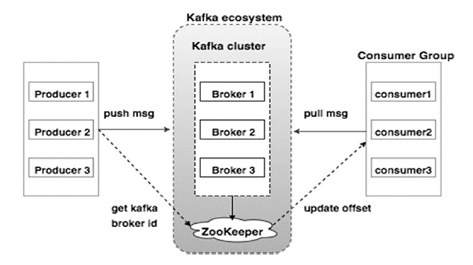

> Брокер сообщений. Создан в facebook, передан под apache и в open source.
* Умеет журналировать и довольно надёжно доставляет сообщения
* Поддерживает все модели ассинхронного обмена
* Неудобный в настройке
# Entities

* **Brokers** - узлы, хранящие сообщения, обработчики запросов от producers и consumers. Отвечает за управление партициями (partitions), в партицаиях лежат топики
* **Topics** - логические каналы (~ новостные топики), раскидывают сообщения по категориям
* **Producers** - клиенты, которые публикуют сообщения в топики
* **Consumers** - клиенты, потребляющие сообщения из топика
* **ZooKeeper** - сервис-контроллер кластера, содержит метаданные о всех компонентах выше