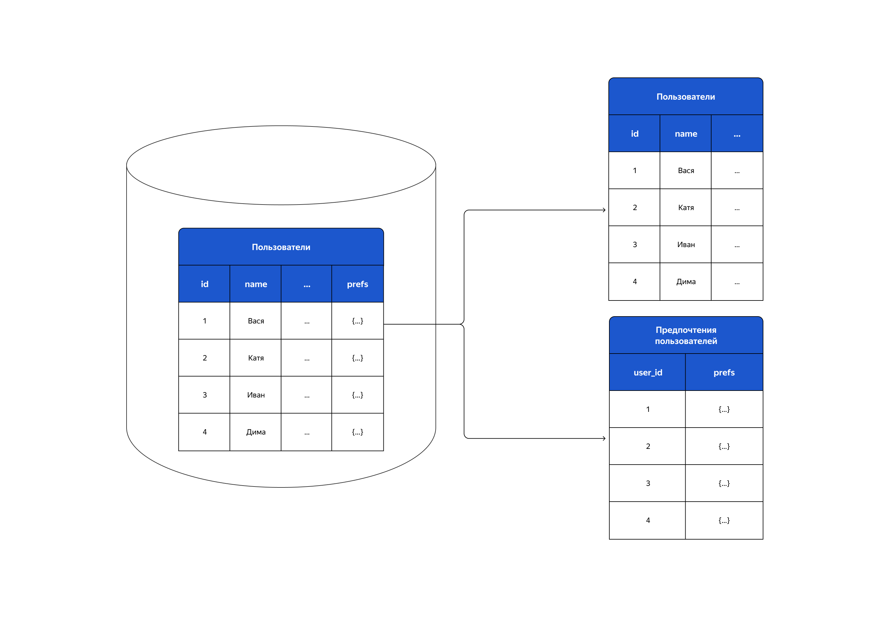
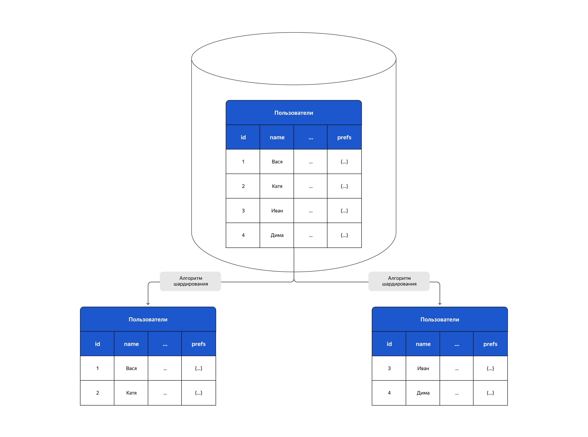
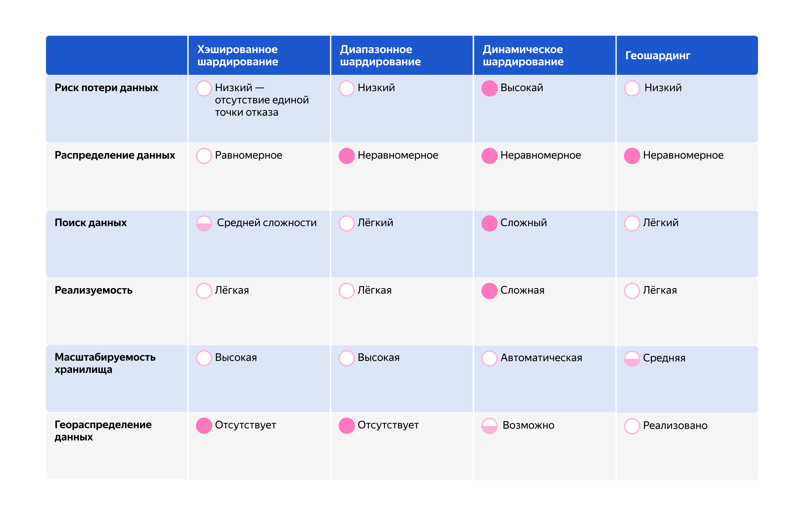
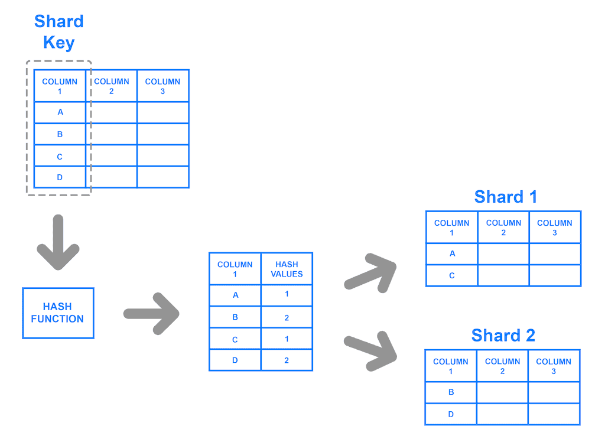

> Прежде всего речь пойдёт про **партицирование (partition)**.
> Это метод разбиение кучи данных на сегменты.

# Partition types
## Vertical
> Таблицу разбивают на несколько подтаблиц с различными колонками (атрибутами)

* Полезно, когда запросам приходится сканировать огромное кол-во атрибутов (столбцов)
## Hotizontal, Sharding 
> Горизонтальным (или же шардирование) - данные одной таблицы распределяются на несколько

	
* Основной смысл горизонтального масштабирования (т.е. если не хватает 1 "трубки" и её пропускной способности, то можно сделать много "трубок")
* Не единая точка отказа
* Ускоряет запросы (т.к. порой одинаковые запросы могут обращаться к разным шардам, а не к одной и то же таблице/БД)
* Но неравномерная нагрузка серверов
* Сложные запросы могут затрагивать несколько шардов и долго обрабатываться
* Распределённость всегда ведёт к сложному мониторингу, так и с этим случаем...
# Стратегии

## key-based
> Значения столбцов хэшируются и по хэш значению распределяются

* Около-равномерное распределение данных, и это **важнейший критерий** тут
* Высокая производительность из-за природы хэша
* Иногда трудно искать некоторую инфу
## range-based
> Основано на диапазоне ключей

* Легко искать
* Легко реализовать самописный алгоритм
* Возможна сильная неравномерность шардов
## dynamic
> Довольно хитрый механизм, который шардирует данные по своим алгоритмам на основе нагрузки на БД
## geo
> Расположение данных зависит от географической зоны
## directory-based
> Работает по принципу DNS, есть центральный шард, который в случае чего, знает куда обратиться для получения нужных данных

