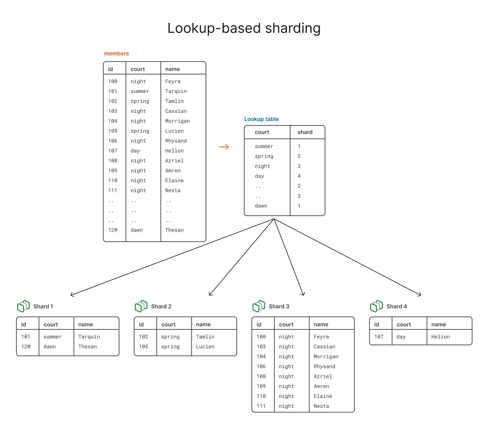

> **Шардирование** — это разделение хранилища на несколько независимых частей, шардов. 
> **shard** — **осколок** хранилища.

> **partitioning** - похожий термин, но разделение данных происходит внутри 1 БД, когда шардирование разбивает данные одной БД по нескольким экземплярам БД.

# Стратегии
## range-based
> Основано на диапазоне ключей

## directory-based
> Работает по принципе DNS, есть центральный шард, который в случае чего, знает куда обратиться для получения нужных данных

## geographical
> Основано на географическом местоположении пользователя запроса