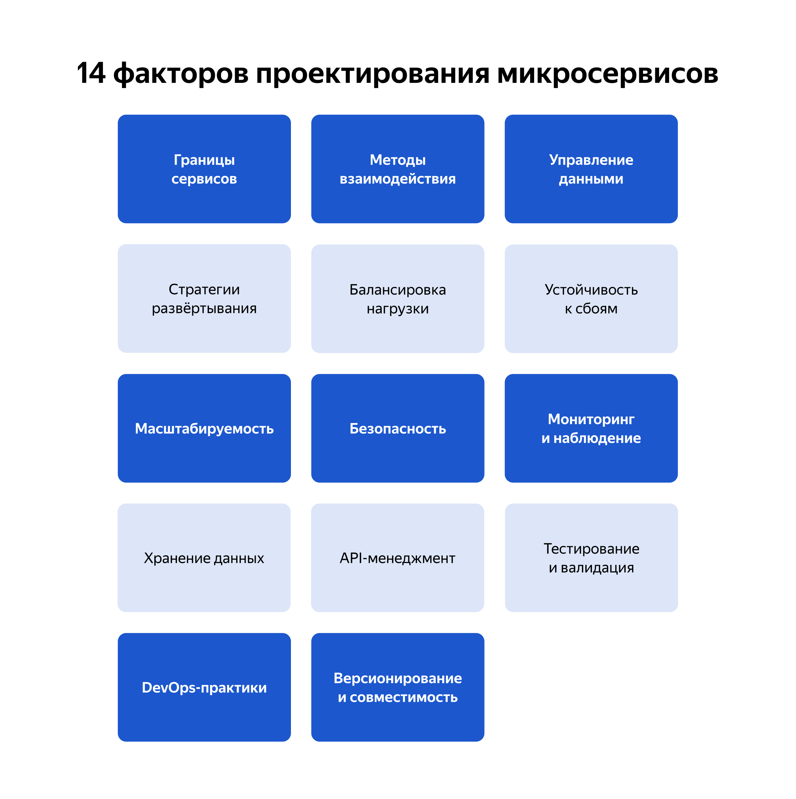

# Границы сервисов
> Необходимо понять какие основные бизнес-задачи (или домены) есть у приложения
# Методы взаимодействия
## Синхронные
> Когда нужна консистентность данных
### REST
* Легко внедрить
* Легко масштабировать
* Довольно стандартизированный и стабильный интерфейс (из определения + возможность возводить версии "рядом")
* Интероперабельность
### RPC
* Тяжелее внедрять, но значительно быстрее
* Некоторые фреймворки всё же интероперабельны
* Проверка данных на этапе вызова из-за строгой типизации
#### Фреймворки
* **gRPC** - Протобафы, HTTP/2, интеграция с TLS, широкая интероперабельность
* **Apache Thrift** - поддерживает множество протоколов, разработан Facebook
* **Apache Avro** - содержит json схемы и бинарный формат для быстрой сериализации сообщений, поэтому высокая скорость + малые пакеты
* **ZeroC ICA** - *что-то на буржуйском*
* **JSON-RPC** - из-за json медленнее других, нет правил безопасности...
## Асинхронные
> Когда нужна масштабируемость, повышенная отказоустойчивость
* Любая событийно ориентированная технология - **Event Driven Architecture (EDA)**
* Брокеры сообщений
	* **RabbitMQ** - открытый, свой протокол AMQP, умеет в кластеризацию и хорошую маршрутизацию
	* **Apache Kafka** - открытый, высокая скорость
	* **Amazon SQS** - сервис от AWS, умеет в распределённые системы и бессерверные приложения
# Управление данными
Достигается за счёт:
* **Eventual consistency** (ожидается конечной результат всех операций), когда не обязательна немедленная согласованность данных
* **Strong consistency** (все операции чтения возвращают наиболее актуальную последнюю запись), подобная согласованность нужна в фин. операциях обычно
* **Partitions** (разделение данных на мелкие управляемые куски), когда различные домены информации могут использоваться независимо друг от друга
## Распределённые транзации
> Очевидно, что они подчинаются ACID принципам...
### 2PC
> 2 Phase Commit - подход, при котором управление транзакцией делится на этап **подготовки/preparation** (просьба всем причастным сервисам "подготовиться") и этап **фиксации/committing** (если хотя бы один сервис отказывается коммитить, то всем сервисам улетает *отказ/rollback*)
* Когда какой-то сервис долго думает над коммитом, то данные и сервисы блокируются
* Многократный опрос всех сервисов затратный...
### Saga
> Подход, при котором транзакция делится на множество мелких этапов или **локальных транзакций**, а также подразумевает, что в случае ошибки производятся **компенсирующие действия**.
* Хранит для этого файлы состояний конфигураций
#### Orchestration
> Есть некоторый оркестратор, который по порядку (или параллельно, если возможно) отправляет локальные транзакции сервисам, а потом на основе совокупности всех запросов принимает конечно решение (проводим транзакцию или нет)
* Когда важен порядок операций
* Когда комплексные операции
* Когда централизованное управление сильно помогает в поддержке сервиса
* Когда важна транзакционная согласованность
#### Choreography
> Подход, при котором сервисы могут осуществить свою транзакцию и совершить, например, последующий запрос другому сервису, такие сервисы также могут применять компенсирующие действия самостоятельно.
* Когда микросервисы по природе независимы
* Примитивные операции
* Важна масштабируемость
* Довольно удобно использовать в EDA
#### Error treat strategies
> Очень часто применяются чуть ли не все скопом
##### Компенсационные транзакции
* Удобно следить за data consistency
* Удобно сохранять промежуточные результаты
* Писать кучу описаний { Do + Undo } человеку тяжко...
* А ещё с этим удвоенным набором транзакций тяжко обеспечивать изоляцию данных и их консистентность
##### Retry
* Для временных ошибок
* Может увеличить нагрузку системы
##### Timeout
* Ошибки не приходится долго ждать, улучшает отклик системы
* Не решает проблемы
##### Circuit breaker / предохранитель
> Если операции слишком частые и понятно, что они не будут успешными, то такие операции блокируются на время
* Разгружает системы от спамма сбоев
* Неправильная установка порогов может привести к тотальным отказам в обслуживании
##### EDA
> Event Driven...
* Лёгкая расширяемость + удобный отклик другими сервисами
* Неудобно отслеживать состояние транзакций
* Настройка EDA всегда тоже требует некоторой надёжности и отдельной настройки
##### Мониторинг и алерты
> **Prometheus**, **Grafana**
* На алерты может реагировать специальная команда (людей)
* А как жить с ложными срабатываниями?
* Настройка отдельная
#### Tools
* Long Running Actions for MicroProfile - для длинный транзакций
* Axon - CQRS + Event Sourcing + DDD (Domain Driven...)
* Seata Saga Mode - для длинных транзакций
* Eventuate Tram Sagas - JDBC и JPA используют
* Oracle Database
* Apache Camel Saga
### Стратегии развёртывания
> Речь про контейнеры... Однако бывает и поставка пакетов и т.п.
* **Simple** - новая версия прям на месте заменяется... изначальную скопировали, вставили новую. Сервис долго недоступен.
* **Blue-Green** - поддерживаются оба окружения, когда одно из них (новое) прошло все тесты, то трафик переключается на него, теперь неактивное окружение используют для деплоя и тестирования... и так по кругу. Если что-то не так -> переключаем на изначально окружение.
* **Canary** - новая версия приложения разворачивается на нескольких других серверах, небольшая часть реального трафика теперь попадает к ним, если всё в порядке -> напрявляют всё больше трафика. Требуется постоянный мониторинг и проработка логики маршрутизации.
* **Rolling** - части микросервисов постепенно обновляются, т.е. прям целиком сервис не простаивает. Сложно реализовать. Тут уже речь больше про **Kubernetes**.
### Load balance
> *я уже писал много про это*
* Round robin (+Weighted)
* Least connections
* IP Hash
* Random
### Безопасность
> HTTPS, OAuth2/OpenID Connect
### Наблюдение
* **Мониторинг**
	* Prometheus
	* Grafana
* **Логирование** 
	* ELK стэк: Elasticsearch + Logstash + Kibana
	* Grafana loki
* **Трассировка** (это запоминание всей цепочки "откуда и куда")
	* Jaeger
	* Zipkin
### API management
> Обеспечение интерфейсов как для работы с данными и маршрутизации, так и для логирования и безопасности + защита от DDOS и т.п.
* API gateway
	* Kong
	* Apigee
* Документирование
	* Swagger
	* OpenAPI
* Проверка запросов
	* Postman
* Веб сервера
	* Nginx
	* HAProxy
### DevOps stuff
> Тестирование, CI/CD.
> Во все пункты ниже можно добавить Gitlab, в нём буквально всё...
* Инфарструктура
	* Terraform
	* Ansible
* CI/CD
	* Jenkins
	* Github Actions
* CI
	* Harbor - в нём можно хранить контейнеры
* Секреты
	* Любые env (древнее) - файлики и т.п.
	* Docker secrets - механизм докера
	* Vault - общий сервис для хранения секретов
* Kubernetes
	* Argo - Строго CD
	* Умеет в масштабирование
	* Репликацию
	* Load balance
	* Helm (и их чарты) - некоторый описатель сервисов